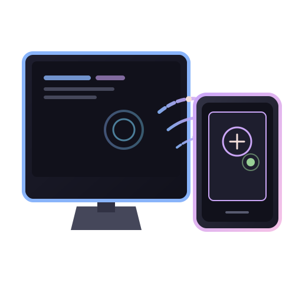

<div align="center">



# Orbiscreen

شاشات فرعية افتراضية مفتوحة المصدر للينكس، تُبَثّ إلى أجهزة أندرويد عبر Wi-Fi أو USB

[](CHANGELOG.md)
[](https://github.com/shadow-x78/orbiscreen/actions/workflows/ci.yml)
[](LICENSE)
[](https://github.com/shadow-x78/orbiscreen/stargazers)

</div>

---

## 🌐 اللغة

<a href="README.md">🇬🇧 English</a> · <a href="README_AR.md">🇸🇦 العربية</a>

---

## 📋 فهرس المحتويات

- [ما هو Orbiscreen؟](#what-is-orbiscreen)
- [لماذا Orbiscreen؟](#why-orbiscreen-exists)
- [أبرز المزايا](#highlights)
- [حالة المشروع](#status)
- [البدء السريع](#quick-start)
- [الأوامر](#commands)
- [هيكل المشروع](#project-structure)
- [البنية](#architecture)
- [التوثيق](#documentation)
- [المساهمة](#contributing)
- [الرخصة](#license)

---

<a id="what-is-orbiscreen"></a>
## 🤔 ما هو Orbiscreen؟

**Orbiscreen** يحوّل جهاز أندرويد إضافي (تابلت أو هاتف) إلى شاشة ثانوية حقيقية لسطح مكتب لينكس. يُنشئ **شاشة افتراضية على مستوى النواة** عبر وحدة `evdi` من DisplayLink، فتظهر كشاشة حقيقية لكل من مركّبات X11 وWayland، ثم يبثّها عبر **WebRTC** مع إرجاع أحداث اللمس إلى المضيف.

<a id="why-orbiscreen-exists"></a>
## 🧭 لماذا Orbiscreen؟

| المشكلة | المشاريع الأخرى | Orbiscreen |
|---------|----------------|------------|
| `spacedesk` بلا دعم لينكس كمضيف | ❌ أعلنوا أنه ليس مخططاً | ✅ لينكس كمضيف أصلي |
| `VirtScreen` على X11 فقط | ❌ متوقف منذ 2018 | ✅ X11 و Wayland |
| `Weylus` شاشة ثانية X11 فقط | ❌ Wayland بوضع المتصفح فقط | ✅ شاشة افتراضية حقيقية |
| لا مشروع يجمع الشاشة الافتراضية + USB + أندرويد | ❌ فجوة | ✅ حل متكامل |

<a id="highlights"></a>
## ✨ أبرز المزايا

- شاشة افتراضية حقيقية عبر `evdi` (تعمل على X11 *و* Wayland)
- بث WebRTC - يفتح من أي متصفح حديث، دون تثبيت تطبيق
- لمس عكسي - أحداث المؤشر ولوحة المفاتيح والقلم تتدفق من أندرويد إلى المضيف
- اكتشاف mDNS - عميل أندرويد يجد المضيف تلقائياً
- نقل USB عبر `adb reverse`، دون تعريفات خاصة
- ترميز بالعتاد - VAAPI، NVENC، x264 احتياطياً

<a id="status"></a>
## 📊 حالة المشروع

| المرحلة | الهدف | الحالة |
|---------|-------|--------|
| 0 | هيكل مساحة العمل + جدوى evdi | ✅ مكتملة |
| 1 | شاشة + التقاط + ترميز + إدخال (X11) | ✅ مكتملة |
| 2 | عميل أندرويد + USB + mDNS | ✅ مكتملة |
| 3 | التقاط Wayland Portal + إدخال | ✅ مكتملة |
| 4 | التغليف + التثبيت المستقل | ✅ مكتملة |

> انظر `CHANGELOG.md` للسجل الكامل للإصدارات.

<a id="quick-start"></a>
## 🚀 البدء السريع

```bash
# استنساخ المستودع
git clone https://github.com/shadow-x78/orbiscreen.git ~/Orbiscreen
cd ~/Orbiscreen

# التثبيت التلقائي بنقرة واحدة للينكس
./scripts/install.sh

# فحص المحركات المحلية والبيئة
orbiscreen probe

# تشغيل الخادم (يدعم EVDI DRM أو التراجع التلقائي لـ Wayland Portal)
orbiscreen start
```

> **تطبيق الأندرويد:** يمكنك تثبيت `app-debug.apk` مباشرة على جهازك (يتم بناؤه في `clients/android/app/build/outputs/apk/debug/app-debug.apk` أو تحميله من قسم GitHub Releases / Actions Artifacts باسم `orbiscreen-android-debug`).

دليل المضيف الكامل موجود في `scripts/setup-dev-env.sh`، وفحص جدوى evdi في `scripts/test-evdi.sh`.

---

<a id="commands"></a>
## ⌨️ الأوامر

| الأمر | الوصف |
|--------|-------|
| `orbiscreen start` | إنشاء الشاشة الافتراضية وبدء البث |
| `orbiscreen start --no-mdns` | بدء التشغيل دون إعلانات mDNS |
| `orbiscreen list-displays` | سرد الشاشات الافتراضية المُعدة |
| `orbiscreen probe` | تقرير عن واجهات الالتقاط والإدخال والعرض |
| `orbiscreen print-config` | طباعة الإعدادات المحلولة |

```bash
orbiscreen --config orbiscreen.toml --verbose probe
```

---

<a id="project-structure"></a>
## 🏗️ هيكل المشروع

```
orbiscreen/
├── crates/
│   ├── orbiscreen-core/        # أنواع، إعداد، أخطاء
│   ├── orbiscreen-display/     # شاشات افتراضية عبر evdi
│   ├── orbiscreen-capture/     # X11 (x11rb) + Wayland (ashpd + PipeWire)
│   ├── orbiscreen-encode/      # خط GStreamer (VAAPI / NVENC / x264)
│   ├── orbiscreen-input/       # evdevil + ashpd RemoteDesktop
│   ├── orbiscreen-transport/   # axum + mDNS + adb reverse + إشارة
│   └── orbiscreen-daemon/      # واجهة CLI تربط كل الطبقات
├── clients/
│   ├── web/                    # عميل المتصفح WebRTC (HTML / CSS / JS)
│   └── android/                # تطبيق Kotlin أندرويد WebView
├── packaging/{flatpak,appimage,debian}/
├── scripts/{setup-dev-env.sh,test-evdi.sh}
├── .github/{workflows/,ISSUE_TEMPLATE/,dependabot.yml}
└── .editorconfig, .gitignore, .gitattributes, deny.toml, rustfmt.toml
```

---

<a id="architecture"></a>
## 🧩 البنية

```
┌──────────────────────────────────────────────────────────────┐
│  orbiscreen-daemon (CLI, clap)                               │
│  ┌──────────────┐  ┌──────────────┐  ┌───────────────────┐   │
│  │ display      │  │ capture      │  │ encode            │   │
│  │  evdi crate  │  │ x11rb/ashpd  │  │ gstreamer-rs      │   │
│  └──────────────┘  └──────────────┘  └───────────────────┘   │
│  ┌──────────────┐  ┌──────────────────────────────────────┐  │
│  │ input        │  │ transport                            │  │
│  │ evdevil/ashpd│  │ axum + webrtc-rs + mdns-sd + adb     │  │
│  └──────────────┘  └──────────────────────────────────────┘  │
│  ┌──────────────────────────────────────────────────────┐    │
│  │ core: shared types, config, errors                   │    │
│  └──────────────────────────────────────────────────────┘    │
└──────────────────────────────────────────────────────────────┘
       │                  │                    │
       ▼                  ▼                    ▼
   /dev/dri/...     X11 / Wayland         Network (mDNS + UDP)
```

---

<a id="documentation"></a>
## 📚 التوثيق

| المستند | الوصف |
|---------|-------|
| [CHANGELOG.md](CHANGELOG.md) | سجل الإصدارات |
| [SECURITY.md](SECURITY.md) | سياسة الأمان والإبلاغ عن الثغرات |
| [docs/TROUBLESHOOTING_AR.md](docs/TROUBLESHOOTING_AR.md) | المشاكل الشائعة والتصحيح |
| [docs/TROUBLESHOOTING.md](docs/TROUBLESHOOTING.md) | Common issues and debugging (EN) |

<a id="contributing"></a>
## 🤝 المساهمة

1. افرد المستودع (Fork)
2. أنشئ فرعاً: `git checkout -b feature/my-feature`
3. أكد التغييرات (Commit)
4. ادفع إلى الفرع (Push)
5. افتح طلب دمج (Pull Request)

---

<a id="license"></a>
## 📜 الرخصة

موزّع تحت رخصة [GPL-3.0 License](LICENSE).

---

<div align="center">

بُني بواسطة <a href="https://github.com/shadow-x78">shadow-x78</a> ·
[سجل التغييرات](CHANGELOG.md) ·
[الأمان](SECURITY.md)

<sub>&copy; 2026 Orbiscreen (shadow-x78)</sub>

</div>
