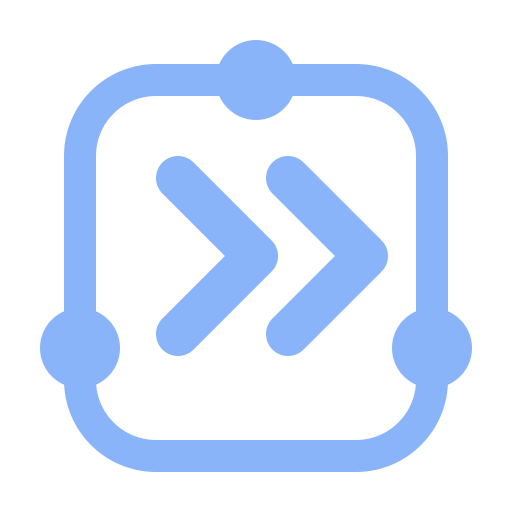

<div align="center">



# Orbiscreen

شاشة افتراضية ثانية حقيقية لنظام Linux، تُبَثّ إلى Android - أمر واحد، بلا تعقيد

[](CHANGELOG.md)
[](LICENSE)


[](https://github.com/shadow-x78/orbiscreen/stargazers)

</div>

---

## 🌐 اللغة

<a href="README.md">🇬🇧 English</a> · <a href="README_AR.md">🇸🇦 العربية</a>

---

## 📋 فهرس المحتويات

- [ما هو Orbiscreen؟](#what-is-orbiscreen)
- [المميزات](#highlights)
- [دعم بيئات سطح المكتب](#desktop-support)
- [البدء السريع](#quick-start)
- [الأوامر](#commands)
- [تطبيق Android](#android-app)
- [المعمارية](#architecture)
- [هيكل المشروع](#project-structure)
- [التوثيق](#documentation)
- [المساهمة](#contributing)
- [الرخصة](#license)

---

<a id="what-is-orbiscreen"></a>
## 🤔 ما هو Orbiscreen؟

**Orbiscreen** يحوّل جهاز Android لوحياً أو هاتفاً إلى شاشة ثانية حقيقية لسطح مكتب Linux. ينشئ **شاشة افتراضية على مستوى النواة** عبر `evdi` من DisplayLink، أو **مونيتوراً افتراضياً أصلياً من الـ compositor** على KDE Plasma وعلى wlroots - بلا root وبلا نافذة مشاركة - ثم يبثّها عبر **MPEG-TS/H.264** مع دعم إدخال اللمس العكسي natively على Android.

| المشكلة | المشاريع الأخرى | Orbiscreen |
|---------|----------------|------------|
| لا دعم Linux للمضيف | ❌ أدوات محصورة بـ Windows | ✅ مبني لـ Linux أولاً |
| حلول محصورة بـ X11 | ❌ تنكسر على Wayland | ✅ X11 **و** Wayland عبر evdi/DRM + IPC الـ compositor |
| بث عبر المتصفح فقط | ❌ كمون عالٍ وبلا لمس | ✅ عميل Android أصلي + لمس عكسي |
| إعداد يدوي لعناوين IP | ❌ كتابة العناوين يدوياً | ✅ اكتشاف mDNS + مسح شبكي مباشر + إضافة يدوية |
| صلاحيات root في كل مكان | ❌ تعديلات نواة على جانب العميل | ✅ بلا root على wlroots وKDE؛ و`doctor --fix` يرشد الباقي |

---

<a id="highlights"></a>
## ✨ المميزات

- **شاشة افتراضية حقيقية عبر `evdi`** (X11 *و* Wayland)، **أو بدون أي root على KDE Plasma**: مونيتور افتراضي يُنشئه KWin عبر `zkde-screencast` (بلا وحدة نواة وبلا نافذة مشاركة)، مع تراجع التقاط portal في غير ذلك
- **عميل Android بواجهة Material 3** - Jetpack Compose، لوحة ألوان Catppuccin Mocha / Latte، بسمة فاتحة وداكنة
- **عميل ويب مبنّى داخلياً** - شاهد من أي متصفح على `http://<host>:8788/` (MSE عبر `mpegts.js` المضمنة محلياً، دون CDN)
- **اكتشاف مباشر** - مسح NSD للمضيفين القريبين، إدخال يدوي `host:port`، وماسح Subnet اختياري
- **بث أصلي** - ExoPlayer مع `OkHttpDataSource` + `DefaultLoadControl` لبث MPEG-TS / H.264 منخفض الكمون
- **حماية بالتوكن** - `/stream` و`/input` و`/api/control` تتطلب توكن بخاص للجلسة (mDNS TXT / `/client/config.json`)، يدور مع كل تشغيل للدامن
- **لمس عكسي** - مؤشر مطلق / لوحة مفاتيح / قلم / عجلة يتدفق من Android إلى المضيف
- **لوحة تحكم بالمضيف** - لوحة مفاتيح، قفل، تعتيم، Ctrl+Alt+Del، وإعادة المحاولة
- **نقل عبر USB** بواسطة `adb reverse` مع hot-plug (جهاز يُوصل لاحقاً يُلتقط خلال ثانيتين)، وإزالة نظيفة للأنفاق عند الإيقاف، وحالة بطاقة "النفق جاهز" الحية في تطبيق Android
- **ترميز عتادي** - VAAPI، NVENC، وتراجع برمجي x264
- **توقيع تشفيري** لكل حزم Linux و Android

---

<a id="desktop-support"></a>
## 🖥️ دعم بيئات سطح المكتب

| البيئة | شاشة ثانية افتراضية | الالتقاط | الإدخال |
|--------|---------------------|----------|---------|
| KDE Plasma (Wayland) | ✅ أصلي (zkde-screencast، بلا root وبلا حوار) | ✅ PipeWire | ✅ portal RemoteDesktop |
| Sway / Hyprland / wlroots | ✅ مخرج headless عبر IPC الـ compositor (بلا root) | ✅ wlr-screencopy (بلا حوار) | ✅ virtual-pointer / virtual-keyboard (بلا portal) |
| GNOME (Wayland) | ⚠️ عبر EVDI | ✅ portal: حوار مرة واحدة فقط (توكن إصرار محفوظ) | ✅ portal RemoteDesktop: بالمثل محفوظ |
| XFCE / MATE / LXQt / Cinnamon (X11) | ✅ عبر EVDI | ✅ XShm للشاشة الجذرية (مجمّع، مع تجاوز الإطارات المتطابقة) | ✅ XTEST (بلا root)، مع تراجع إلى uinput |
| أي بيئة أخرى | ✅ عبر EVDI (بإرشاد `orbiscreen doctor --fix`) | أفضل واجهة متاحة | أفضل واجهة متاحة |

يطبع `orbiscreen doctor` الـ compositor المكتشف وخطة الالتقاط التي سيتبعها `auto` وما الناقص في النظام؛ وينفّذ `orbiscreen doctor --fix` تثبيت وحدة نواة EVDI على التوزيعات المكتشفة. التفاصيل الكاملة في [دليل دعم بيئات سطح المكتب](docs/DE_SUPPORT_AR.md).

---

<a id="quick-start"></a>
## 🚀 البدء السريع

### 1. التثبيت

- **أوبونتو / Pop!_OS / لينكس مينت (Launchpad PPA):**
  ```bash
  sudo add-apt-repository ppa:shadow-x78/ppa -y
  sudo apt update
  sudo apt install orbiscreen -y
  ```

- **فيدورا (COPR):**
  ```bash
  sudo dnf copr enable shadow-x78/orbiscreen -y
  sudo dnf install orbiscreen -y
  ```

- **آرش لينكس (AUR):**
  ```bash
  paru -S orbiscreen
  ```

- **AppImage عالمي (`.AppImage`):**
  حمّل `orbiscreen-x86_64.AppImage` من [GitHub Releases](https://github.com/shadow-x78/orbiscreen/releases):
  ```bash
  chmod +x orbiscreen-x86_64.AppImage
  ./orbiscreen-x86_64.AppImage
  ```

- **أرشيف مستقل (`.tar.gz`):**
  ```bash
  tar -xzvf orbiscreen-linux-x86_64.tar.gz
  ./bin/orbiscreen start
  ```
  ضع ملفات `bin/` على `PATH` لديك (مثلاً `~/.local/bin`) لتشغيل `orbiscreen` من أي مكان. يحتوي الأرشيف على الثنائيات الجاهزة فقط؛ لوحدة systemd ومدخل سطح المكتب وملفات عميل الويب استخدم حزم DEB/RPM/AppImage أو ثبّت من المصدر (أدناه).

- **Android (`.apk`):**
  ثبّت `orbiscreen-android-release.apk` (نسخة موقّعة لتجاوز تحذيرات Play Protect).

### 2. البناء من المصدر (للمساهمين)

```bash
git clone https://github.com/shadow-x78/orbiscreen.git ~/Orbiscreen
cd ~/Orbiscreen

# أمر التثبيت الواحد لنظام Linux
./scripts/install.sh

# وحدة النواة evdi عبر DKMS - مطلوبة لشاشة ثانية حقيقية على X11 وGNOME.
# على KDE Plasma Wayland وعلى compositors عائلة wlroots (Sway، Hyprland)
# لا حاجة لأي وحدة نواة: ينشئ الـ daemon مونيتوراً افتراضياً أصلياً من
# الـ compositor من تلقاء نفسه. شغّل `orbiscreen doctor` لترى ما ينطبق.
sudo modprobe evdi

# تشخيص البيئة: الـ compositor المكتشف، خطة الالتقاط، النواقص
orbiscreen doctor

# تشغيل الخدمة (مع تراجع تلقائي: EVDI DRM أو شاشة افتراضية من
# KWin/wlroots أو Wayland Portal)
orbiscreen start
```

### 3. الاتصال

- **Android:** انقر المضيف المكتشف (عبر mDNS) أو أضفه يدوياً.
- **متصفح الويب:** افتح `http://<host-ip>:8788/` - يخدم الدامن عميل MPEG-TS مباشرةً (MSE + حزمة `mpegts.js` المضمنة محلياً).
- **التوكن:** تُولد كل بدءة للدامن توكن جلسة. يحصل Android عليه تلقائياً من الاكتشاف؛ عميل الويب يجلبه من `/client/config.json`. إذا رفض العميل برفض `401 Unauthorized`، أعد الاكتشاف أو أعد تشغيل العميل - قد يكون التوكن قد دار.

> تفضيل واجهة الالتقاط عبر `orbiscreen.toml` (`auto` الافتراضي، مع `kwin-virtual` / `screencopy` / `evdi` / `portal` / `mirror`) موثق بالكامل في [دليل دعم بيئات سطح المكتب](docs/DE_SUPPORT_AR.md).

---

<a id="commands"></a>
## ⌨️ الأوامر

| الأمر | الوصف |
|-------|-------|
| `orbiscreen start` | ينشئ الشاشة الافتراضية ويبدأ البث |
| `orbiscreen start --no-mdns` | تشغيل دون إعلان mDNS |
| `orbiscreen stop` | إيقاف دامن قيد التشغيل رشيقاً عبر D-Bus |
| `orbiscreen list-displays` | سرد الشاشات الافتراضية المُهيّأة |
| `orbiscreen probe` | فحص واجهات الالتقاط / الإدخال / الشاشة |
| `orbiscreen doctor` | تشخيص البيئة: الـ compositor، خطة الالتقاط، الأذونات والأدوات الناقصة |
| `orbiscreen doctor --json` | تقرير doctor بصيغة آلية (تستهلكه لوحة GTK) |
| `orbiscreen doctor --fix` | كشف التوزيعة وعرض تثبيت/تحميل وحدة نواة EVDI مع التأكيد (`--yes` لتجاوز السؤال) |
| `orbiscreen print-config` | طباعة الإعدادات الفعلية |
| `orbiscreen uninstall` | إزالة الخدمة وخدمة systemd ومدخلات سطح المكتب |

---

<a id="android-app"></a>
## 📱 تطبيق Android

عميل Android هو تطبيق **Material 3 + Jetpack Compose** بنشاط واحد (single-Activity)، مع ثلاث شاشات مربوطة عبر Compose Navigation:

| الشاشة | ماذا تفعل |
|--------|-----------|
| **Discovery** | مسح NSD مباشر لخدمات `_orbiscreen._tcp.`، شرائح اتصال سريعة، إدخال يدوي `host:port`، وضع USB عبر `adb reverse`، والمضيف الأخير في الأعلى |
| **Stream** | ExoPlayer بملء الشاشة (MPEG-TS عبر HTTP) مع شريط تحكم عائم: لوحة مفاتيح، قفل، تعتيم، Ctrl+Alt+Del، إعادة محاولة |
| **Settings** | السمة (النظام / فاتح / داكن)، إجبار المُرمّز البرمجي، ماسح Subnet المتقدم، المضيف الأخير، حول |

اللمس العكسي يعمل مباشرة: يحوّل `InputDispatcher` لمس Android إلى إحداثيات مطلقة للمضيف عبر نقطة `/input`، مع إزالة تكرار حتى لا تتراكم الشبكة أثناء السحب السريع.

يتصل العميل بالخدمة عبر ثلاث نقاط JSON خفيفة إضافةً إلى `/stream` و `/input`:

| النقطة | الطريقة | الغرض |
|--------|---------|-------|
| `/api/info` | GET | دقة الشاشة والمُرمّز والإصدار |
| `/api/control` | POST | أوامر المضيف (blank، unblank، lock، ctrl-alt-del)؛ يتطلب توكن |
| `/health` | GET | فحص الحيوية |

---

<a id="architecture"></a>
## 🏗️ المعمارية

```
┌──────────────────────────────────────────────────────────────┐
│  orbiscreen-daemon ‏(CLI، clap)‏                               │
│  ┌──────────────┐  ┌──────────────┐  ┌───────────────────┐   │
│  │ display      │  │ capture      │  │ encode            │   │
│  │  evdi crate  │  │ x11rb/ashpd  │  │ gstreamer-rs      │   │
│  └──────────────┘  └──────────────┘  └───────────────────┘   │
│  ┌──────────────┐  ┌──────────────────────────────────────┐  │
│  │ input        │  │ transport                            │  │
│  │ evdevil/ashpd│  │ axum + mdns-sd + adb                 │  │
│  │              │  │ + /api/info + /api/control + /health  │  │
│  └──────────────┘  └──────────────────────────────────────┘  │
│  ┌──────────────────────────────────────────────────────┐    │
│  │ core: الأنواع والإعدادات والأخطاء المشتركة           │    │
│  └──────────────────────────────────────────────────────┘    │
└──────────────────────────────────────────────────────────────┘
       │                  │                    │
       ▼                  ▼                    ▼
   /dev/dri/...     X11 / Wayland         الشبكة ‏(mDNS + HTTP)‏
```

---

<a id="project-structure"></a>
## 🏗️ هيكل المشروع

```
orbiscreen/
├── crates/
│   ├── orbiscreen-core/        # الأنواع والإعدادات والأخطاء
│   ├── orbiscreen-display/     # شاشات افتراضية مدعومة بـ evdi
│   ├── orbiscreen-capture/     # X11 ‏(x11rb) + Wayland ‏(KWin zkde-screencast / ashpd portal + PipeWire)
│   ├── orbiscreen-encode/      # خط أنابيب GStreamer ‏(VAAPI / NVENC / x264)
│   ├── orbiscreen-input/       # evdevil + ashpd RemoteDesktop
│   ├── orbiscreen-transport/   # axum + mDNS + /api/info + /api/control
│   └── orbiscreen-daemon/      # ثنائي CLI يربط كل الطبقات
├── clients/
│   ├── web/                    # عميل متصفح MPEG-TS ‏(HTML / CSS / JS)
│   └── android/                # تطبيق Material 3 Compose
│       └── app/src/main/java/com/orbiscreen/android/
│           ├── MainActivity.kt
│           ├── data/           # PrefsStore ‏(المضيف الأخير + الإعدادات)
│           ├── net/            # DiscoveryService, SubnetScanner, HostApi
│           ├── player/         # PlayerHolder, StreamUrl
│           ├── input/         # InputDispatcher
│           └── ui/            # theme، nav، discovery، stream، settings
├── assets/
│   └── logo/                   # شعار المشروع ‏(SVG + مجموعة PNG)
├── data/                       # مدخل سطح المكتب وspec RPM والـSVG الرئيسي
├── scripts/                    # التثبيت والحزم (deb / rpm / AppImage) وأدوات التطوير
├── docs/                       # أدلة ثنائية اللغة (EN + AR)
├── .github/{workflows/,ISSUE_TEMPLATE/,PULL_REQUEST_TEMPLATE.md}
└── .editorconfig, .gitignore, .gitattributes, deny.toml, rustfmt.toml
```

---

<a id="documentation"></a>
## 📚 التوثيق

| المستند | الوصف |
|---------|-------|
| [ARCHITECTURE_AR.md](docs/ARCHITECTURE_AR.md) | طوبولوجيا النظام وخط أنابيب الإطارات ومعمارية D-Bus |
| [DE_SUPPORT_AR.md](docs/DE_SUPPORT_AR.md) | مصفوفة دعم كل بيئة سطح مكتب وخطط الالتقاط وحلول الأعطال |
| [PACKAGING_AR.md](docs/PACKAGING_AR.md) | مواصفات التغليف متعدد التوزيعات ‏(.deb، .rpm، AppImage)‏ |
| [DBUS_SPEC_AR.md](docs/DBUS_SPEC_AR.md) | مواصفات واجهة D-Bus Session Bus |
| [TROUBLESHOOTING_AR.md](docs/TROUBLESHOOTING_AR.md) | المشاكل الشائعة والتشخيص وإصلاحات التسريع العتادي |

---

<a id="contributing"></a>
## 🤝 المساهمة

1. اعمل Fork للمستودع
2. أنشئ فرعاً جديداً: `git checkout -b feature/my-feature`
3. التزم بالتغييرات: `orbiscreen | <type>: <description>`
4. ادفع إلى الفرع
5. افتح Pull Request

راجع [إرشادات المساهمة](CONTRIBUTING.md) لبيئة التطوير وأسلوب الكود وعملية الإصدار.

---

<a id="license"></a>
## 📜 الرخصة

مرخّص تحت [رخصة GPL-3.0](LICENSE).

---

<div align="center">

بُني بواسطة <a href="https://github.com/shadow-x78">shadow-x78</a> ·
[سجل التغييرات](CHANGELOG.md) ·
[الأمان](SECURITY.md)

<sub>&copy; 2026 Orbiscreen</sub>

</div>
