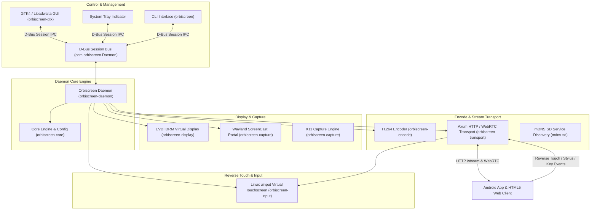

# Architecture Specification - Orbiscreen

---

## 🌐 Language

<a href="ARCHITECTURE.md">🇬🇧 English</a> · <a href="ARCHITECTURE_AR.md">🇸🇦 العربية</a>

---

## 🏛 System Architecture Overview

Orbiscreen is built as a modular multi-crate Rust workspace separating system display drivers, frame capture engines, hardware-accelerated video encoders, inter-process communication (D-Bus), and multi-protocol network transports.

---

## 📦 Workspace Crate Topology

| Crate | Responsibility | Key Dependencies |
|-------|----------------|------------------|
| `orbiscreen-core` | Shared configuration, error types, serialization | `serde`, `toml` |
| `orbiscreen-display` | EVDI DRM virtual display creation & EDID synthesis | `evdi`, `libc` |
| `orbiscreen-capture` | Wayland Portal (ashpd) & X11 (x11rb) capture engines | `ashpd`, `x11rb` |
| `orbiscreen-encode` | Hardware & software H.264 encoding pipelines | `gstreamer`, `gstreamer-app` |
| `orbiscreen-input` | Reverse touch, stylus, and keyboard injection | `evdevil`, `nix` |
| `orbiscreen-transport` | Axum HTTP `/stream`, WebRTC signaling & ADB reverse | `axum`, `webrtc`, `tokio` |
| `orbiscreen-daemon` | Main daemon binary, systemd integration & D-Bus service | `zbus`, `clap`, `tokio` |
| `orbiscreen-gtk` | Native GTK4 / Libadwaita desktop GUI control panel | `gtk4`, `libadwaita`, `zbus` |

---

## ⚡ Zero-Copy Stream Pipeline

1. **Virtual Monitor Provisioning:** `orbiscreen-display` provisions a virtual DRM connector via EVDI (or falls back to `xdg-desktop-portal` ScreenCast session).
2. **Frame Capture:** Raw BGRA frame buffers are grabbed via PipeWire DMA-BUF / X11 Shared Memory.
3. **Hardware Encoding:** GStreamer encodes frames into H.264 Annex B NAL units (`orbiscreen-encode`).
4. **Multi-Protocol Broadcast:** Encoded chunks are broadcast simultaneously over `/stream` HTTP GET (Axum) and WebRTC RTP video tracks.
5. **Reverse Touch Injection:** Input events sent by Android client or Web UI are mapped through `TouchCalibration` and injected directly into Linux kernel `/dev/uinput`.
