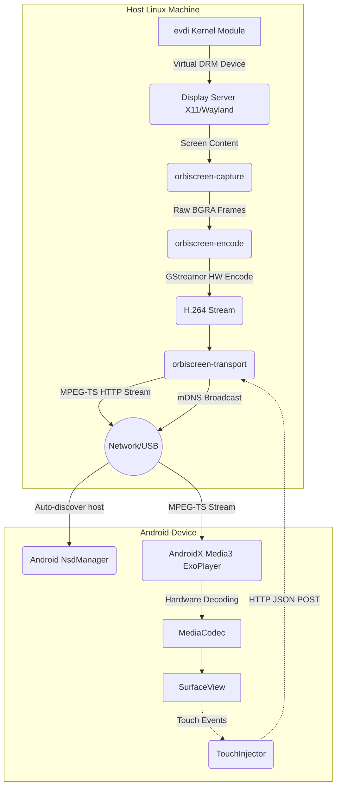

# Architecture Specification - Orbiscreen

## 🏛 System Architecture Overview

Orbiscreen is built as a modular multi-crate Rust workspace separating system display drivers, frame capture engines, hardware-accelerated video encoders, inter-process communication (D-Bus), and multi-protocol network transports.

```mermaid
graph TD
    subgraph Host Linux Machine
        A[evdi Kernel Module] -->|Virtual DRM Device| B(Display Server X11/Wayland)
        B -->|Screen Content| C(orbiscreen-capture)
        C -->|Raw BGRA Frames| D(orbiscreen-encode)
        D -->|GStreamer HW Encode| E(H.264 Stream)
        E --> F(orbiscreen-transport)
        F -->|MPEG-TS HTTP Stream| G((Network/USB))
        F -->|mDNS Broadcast| G
    end

    subgraph Android Device
        G -->|Auto-discover host| H(Android NsdManager)
        G -->|MPEG-TS Stream| I(AndroidX Media3 ExoPlayer)
        I -->|Hardware Decoding| J[MediaCodec]
        J --> K[SurfaceView]
        K -.->|Touch Events| L(TouchInjector)
        L -.->|HTTP JSON POST| F
    end
```

---

## 📦 Workspace Crate Topology

| Crate | Responsibility | Key Dependencies |
|-------|----------------|------------------|
| `orbiscreen-core` | Shared configuration, error types, serialization | `serde`, `toml` |
| `orbiscreen-display` | EVDI DRM virtual display creation & EDID synthesis | `evdi`, `libc` |
| `orbiscreen-capture` | Wayland Portal (ashpd) & X11 (x11rb) capture engines | `ashpd`, `x11rb` |
| `orbiscreen-encode` | Hardware & software H.264 encoding pipelines | `gstreamer`, `gstreamer-app` |
| `orbiscreen-input` | Reverse touch, stylus, and keyboard injection | `evdevil`, `nix` |
| `orbiscreen-transport` | Axum HTTP MPEG-TS `/stream` & ADB reverse | `axum`, `gstreamer`, `tokio` |
| `orbiscreen-daemon` | Main daemon binary, systemd integration & D-Bus service | `zbus`, `clap`, `tokio` |
| `orbiscreen-gtk` | Native GTK4 / Libadwaita desktop GUI control panel | `gtk4`, `libadwaita`, `zbus` |

---

## ⚡ Zero-Copy Stream Pipeline

1. **Virtual Monitor Provisioning:** `orbiscreen-display` provisions a virtual DRM connector via EVDI (or falls back to `xdg-desktop-portal` ScreenCast session).
2. **Frame Capture:** Raw BGRA frame buffers are grabbed via PipeWire DMA-BUF / X11 Shared Memory.
3. **Hardware Encoding:** 
- **orbiscreen-encode**: Consumes the raw X11/PipeWire frame buffers and encodes them into H.264 using hardware-accelerated GStreamer pipelines (VAAPI, NVENC, or fallback x264).
- **orbiscreen-transport**: Wraps the encoded H.264 NAL units into an MPEG-TS container and serves them over an HTTP stream. Also handles reverse touch injection and mDNS broadcasting.
- **Android Client**: A native Android application that automatically discovers the daemon via mDNS, fetches the MPEG-TS stream, and decodes it using AndroidX Media3 (ExoPlayer) which hooks directly into the device's hardware `MediaCodec` for zero-latency playback. It also intercepts touch events on the `SurfaceView` and translates them into relative pointer motions for the daemon.

---

Built by <a href="https://github.com/shadow-x78">shadow-x78</a> ·
[Back to README](../README.md)

&copy; 2026 Orbiscreen (shadow-x78)

