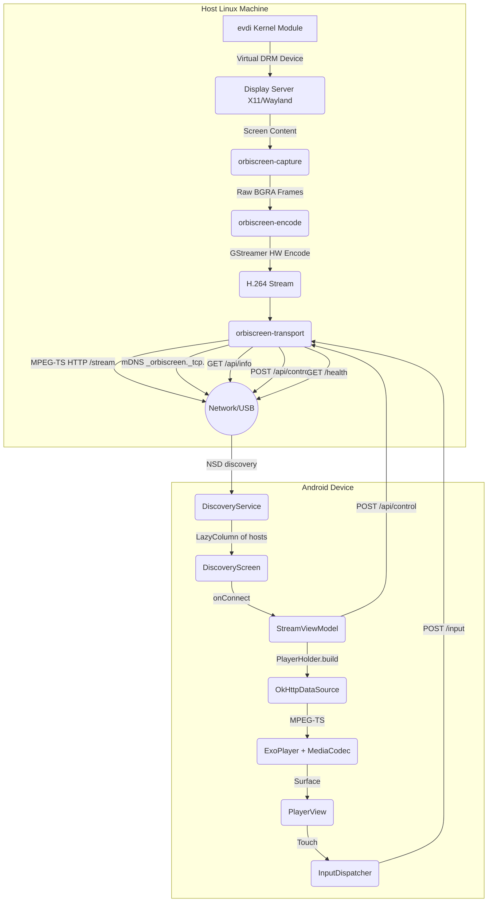

# Architecture Specification - Orbiscreen

> Applies to **v0.10.2** and later.

Orbiscreen is built as a modular multi-crate Rust workspace separating system display drivers, frame capture engines, hardware-accelerated video encoders, inter-process communication (D-Bus), and multi-protocol network transports.

---

## 🏛 System Architecture Overview


```mermaid
graph TD
    subgraph Host Linux Machine
        A[evdi Kernel Module] -->|Virtual DRM Device| B(Display Server X11/Wayland)
        B -->|Screen Content| C(orbiscreen-capture)
        C -->|Raw BGRA Frames| D(orbiscreen-encode)
        D -->|GStreamer HW Encode| E(H.264 Stream)
        E --> F(orbiscreen-transport)
        F -->|MPEG-TS HTTP /stream| G((Network/USB))
        F -->|mDNS _orbiscreen._tcp.| G
        F -->|GET /api/info| G
        F -->|POST /api/control| G
        F -->|GET /health| G
    end

    subgraph Android Device
        G -->|NSD discovery| H(DiscoveryService)
        H -->|LazyColumn of hosts| I(DiscoveryScreen)
        I -->|onConnect| J(StreamViewModel)
        J -->|PlayerHolder.build| K(OkHttpDataSource)
        K -->|MPEG-TS| L(ExoPlayer + MediaCodec)
        L -->|Surface| M(PlayerView)
        M -->|Touch| N(InputDispatcher)
        N -->|POST /input| F
        J -->|POST /api/control| F
    end
```

---

## 📦 Workspace Crate Topology

| Crate | Responsibility | Key Dependencies |
|-------|----------------|------------------|
| `orbiscreen-core` | Shared configuration, error types, serialization | `serde`, `toml` |
| `orbiscreen-display` | EVDI DRM virtual display creation & EDID synthesis | `evdi`, `libc` |
| `orbiscreen-capture` | Wayland Portal (ashpd) & X11 (x11rb) capture engines | `ashpd`, `x11rb` |
| `orbiscreen-encode` | Hardware & software H.264 encoding pipelines | `gstreamer`, `gstreamer-app` |
| `orbiscreen-input` | Reverse touch, stylus, and keyboard injection | `evdevil`, `nix` |
| `orbiscreen-transport` | Axum HTTP `/stream`, mDNS, ADB reverse, `/api/info`, `/api/control`, `/health` | `axum`, `gstreamer`, `tokio` |
| `orbiscreen-daemon` | Main daemon binary, systemd integration & D-Bus service | `zbus`, `clap`, `tokio` |
| `orbiscreen-gtk` | Native GTK4 / Libadwaita desktop GUI control panel | `gtk4`, `libadwaita`, `zbus` |

---

## 📱 Android Client Package Layout

```
com.orbiscreen.android/
├── MainActivity.kt                # Compose host, observes PrefsStore.themePrefFlow
├── data/
│   └── PrefsStore.kt              # SharedPreferences (recent host, theme, scanner toggle)
├── net/
│   ├── DiscoveryService.kt        # NsdManager wrapper -> StateFlow<Map<DiscoveredHost>>
│   ├── SubnetScanner.kt           # /24 sweep with Semaphore-bounded parallelism
│   ├── HostApi.kt                 # OkHttp client for /api/info, /api/control, /health
│   ├── WifiGatewayProvider.kt     # Reads WifiManager.dhcpInfo.gateway
│   └── DiscoveryModel.kt          # HostSpec regex validator
├── player/
│   ├── PlayerHolder.kt            # ExoPlayer + OkHttpDataSource + DefaultLoadControl
│   └── StreamUrl.kt               # Builds http://host:port/stream.ts?fmt=mp2t
├── input/
│   └── InputDispatcher.kt         # Absolute-coord pointer / wheel / keyboard / stylus
└── ui/
    ├── theme/                     # Material 3 Color.kt, Theme.kt, Type.kt
    ├── nav/OrbiNav.kt             # NavHost (Discovery / Stream / Settings)
    ├── discovery/                 # DiscoveryScreen + DiscoveryViewModel
    ├── stream/                    # StreamScreen, PlayerSurface, ControlToolbar
    └── settings/                  # SettingsScreen (theme, decoder, scanner, recent host)
```

---

## ⚡ Zero-Copy Stream Pipeline

1. **Virtual Monitor Provisioning:** `orbiscreen-display` provisions a virtual DRM connector via EVDI (or falls back to the `xdg-desktop-portal` ScreenCast session).
2. **Frame Capture:** Raw BGRA frame buffers are grabbed via PipeWire DMA-BUF / X11 Shared Memory.
3. **Hardware Encoding:**
   - `orbiscreen-encode` consumes the raw X11 / PipeWire frame buffers and encodes them into H.264 using hardware-accelerated GStreamer pipelines (VAAPI, NVENC, or fallback x264).
   - `orbiscreen-transport` wraps the encoded H.264 NAL units into an MPEG-TS container and serves them over `http://host:port/stream.ts`.
4. **Android Playback:**
   - `PlayerHolder.build()` runs on the Main thread (`withContext(Dispatchers.Main)`) to prevent thread access crashes on Connect.
   - All builder and dataSource initializations inside `PlayerHolder.build()` are wrapped in a try-catch block to surface construction errors as `StreamEvent.Error` retry cards.
   - `PlayerHolder` builds `MediaItem` with `MimeTypes.VIDEO_MP2T` so ExoPlayer decodes MPEG-TS without sniffing.
   - `OkHttpDataSource` is configured with a zero read-timeout (live stream) and a tuned `DefaultLoadControl` (1.5 s min / 5 s max buffer).
   - The `PlayerHolder` exposes a `Player.Listener` that maps `Player.STATE_*` transitions to `StreamEvent` for the Compose UI.
5. **Reverse Input:**
   - `InputDispatcher` maps pointer / wheel / stylus / keyboard events from Android's `PlayerView` rect into absolute host coordinates using the host's `/api/info` reported resolution.
   - Events are debounced through a `MutableSharedFlow` with `BufferOverflow.DROP_OLDEST` to prevent backlog during fast drags.
6. **Host Control:**
   - `HostApi.sendControl` posts JSON actions to `/api/control` for lock, blank, ctrl-alt-del, and file-manager requests.

---

## 🌐 HTTP API Contract

| Endpoint | Method | Body | Response |
|----------|--------|------|----------|
| `/stream` | GET | — | `video/mp2t` MPEG-TS stream |
| `/health` | GET | — | `200 OK "ok"` |
| `/api/info` | GET | — | `{"display_width":1920,"display_height":1080,"refresh_hz":60,"encoder":"x264","version":"0.10.2"}` |
| `/api/control` | POST | `{"action":"lock"\|"blank\|"unblank"\|"ctrl_alt_del"\|"open","state":"on\|off","target":"files"}` | `200 OK` |

Input events (`/input`) accept the same payload schema as the existing web client: `Move{x,y}`, `Button{button,pressed,x?,y?}`, `Wheel{deltaY}`, `Key{code,pressed}`, `Stylus{x,y,pressure,tilt_x,tilt_y}`.

---

## 🔌 Transport Optimisations

- **OkHttpDataSource:** zero read-timeout, long-lived socket, custom `User-Agent: Orbiscreen-Android/1.0` for friendlier server logs.
- **DefaultLoadControl:** buffers 1.5 s minimally, 5 s maximally to absorb Wi-Fi jitter without exploding RAM.
- **Broadcast channel:** `video_tx` is a `tokio::sync::broadcast` so multiple HTTP clients can subscribe to the same encoded stream without backpressure on the encoder.
- **Protobuf-free:** payloads use `org.json.JSONObject` for both directions to keep the on-wire contract symmetric with the web client.

---

## 🔁 Lifecycle

- `PlayerHolder` is owned by `StreamViewModel`; release happens in `onCleared()`.
- `InputDispatcher` is constructed lazily on first touch and released together with the player.
- `DiscoveryService` is started in `DiscoveryViewModel.init` and detached with the view model scope.

---

<div align="center">

Built by <a href="https://github.com/shadow-x78">shadow-x78</a> ·
[Back to README](../README.md)

<sub>&copy; 2026 Orbiscreen (shadow-x78)</sub>

</div>
