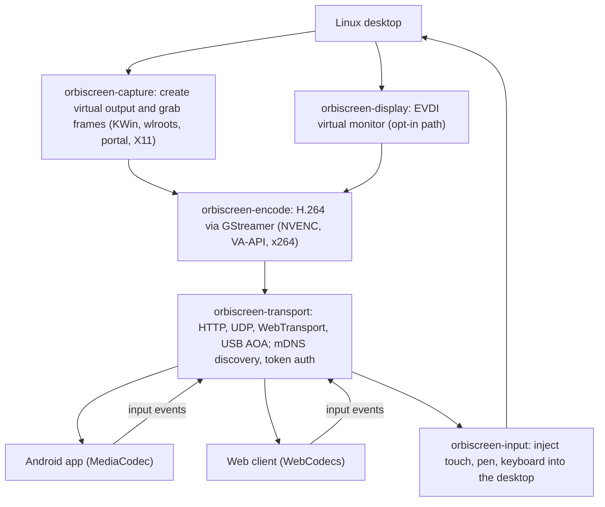

<div align="center">

# Architecture Specification - Orbiscreen

[](../CHANGELOG.md)
[](../LICENSE)


</div>

---

## Language

<a href="ARCHITECTURE.md">🇬🇧 English</a> · <a href="ARCHITECTURE_AR.md">🇸🇦 العربية</a>

---

Orbiscreen is built as a modular multi-crate Rust workspace separating system display drivers, frame capture engines, hardware-accelerated video encoders, inter-process communication (D-Bus), and multi-protocol network transports.

---

## System Architecture Overview

One daemon on the Linux host, many clients. Video flows one way (host to client); input flows back:


```mermaid
flowchart TD
    DESK["Linux desktop"]
    CAP["orbiscreen-capture: create virtual output and grab frames (KWin, wlroots, portal, X11)"]
    EVDI["orbiscreen-display: EVDI virtual monitor (opt-in path)"]
    ENC["orbiscreen-encode: H.264 via GStreamer (NVENC, VA-API, x264)"]
    TR["orbiscreen-transport: HTTP, UDP, WebTransport, USB AOA; mDNS discovery, token auth"]
    IN["orbiscreen-input: inject touch, pen, keyboard into the desktop"]
    AND["Android app (MediaCodec)"]
    WEB["Web client (WebCodecs)"]

    DESK --> CAP
    DESK --> EVDI
    CAP --> ENC
    EVDI --> ENC
    ENC --> TR
    TR --> AND
    TR --> WEB
    AND -->|input events| TR
    WEB -->|input events| TR
    TR --> IN
    IN --> DESK
```

The same loop in words:

1. A virtual display is created by `orbiscreen-capture` (KWin virtual output, wlroots headless output, or portal virtual) or by `orbiscreen-display` (EVDI kernel path).
2. `orbiscreen-capture` (or the EVDI frame pump) grabs frames from that output.
3. `orbiscreen-encode` converts BGRA frames to H.264 with hardware encoders.
4. `orbiscreen-transport` serves the stream to Android (UDP Annex-B, USB AOA Annex-B, HTTP MPEG-TS fallback) and to browsers (WebTransport Annex-B).
5. Clients send input events back through `orbiscreen-transport`.
6. `orbiscreen-input` injects them into the desktop (uinput, XTEST, wlroots virtual devices, or portal RemoteDesktop).

The daemon process (`orbiscreen-daemon`) wires all crates together and exposes a D-Bus service; the desktop GUI (`orbiscreen-gui`, Tauri v2) and the CLI talk to it over D-Bus.

---

## Workspace Crate Topology

| Crate | Responsibility | Key Dependencies |
|-------|----------------|------------------|
| `orbiscreen-core` | Shared configuration, error types, serialization, paths (config, token) | `serde`, `toml`, `thiserror` |
| `orbiscreen-display` | EVDI kernel virtual display: DRM connector, EDID synthesis, framebuffer to BGRA pump (`EvdiFramePump`) | `evdi`, `drm-fourcc`, `tokio` |
| `orbiscreen-capture` | Virtual output creation (KWin via `zkde-screencast`, wlroots headless via IPC) plus frame capture: portal (ashpd/PipeWire), wlr-screencopy, X11 (x11rb), damage pump, capability detection | `ashpd`, `x11rb`, `wayland-*`, `orbiscreen-core` |
| `orbiscreen-encode` | H.264 pipelines: NVENC, VA-API, x264 software; low-latency VBV and GOP tuning | `gstreamer`, `gstreamer-app`, `orbiscreen-core` |
| `orbiscreen-input` | Reverse input injection: uinput touchscreen/tablet/keyboard, XTEST, wlroots virtual-pointer/virtual-keyboard, portal RemoteDesktop | `evdevil`, `ashpd`, `orbiscreen-core` |
| `orbiscreen-transport` | All client-facing protocol surfaces: HTTP `/stream` `/input` `/api/*` `/health`, UDP Annex-B with Reed-Solomon FEC, WebTransport Annex-B (`wt_port`), USB AOA bulk video, mDNS advertising, pairing, token auth, per-client display session routing | `axum`, `mdns-sd`, `wtransport`, `gstreamer`, `orbiscreen-core`, `orbiscreen-input` |
| `orbiscreen-daemon` | Binary that wires every crate together; systemd integration; D-Bus service (`com.orbiscreen.Daemon`); `doctor` diagnostics | `zbus`, `clap`, `tokio` |
| `orbiscreen-gui` | Desktop control center (Tauri v2): status, start/stop, resolution chips over D-Bus | `zbus`, `serde_json` |

---

## Android Client Package Layout

```
com.orbiscreen.android/
├── MainActivity.kt                # Compose host, theme from PrefsStore
├── data/
│   ├── PrefsStore.kt              # theme, recent host, scanner toggle
│   └── HostCredentialStore.kt     # saved host tokens
├── net/
│   ├── DiscoveryService.kt        # NSD (mDNS) discovery -> StateFlow of hosts
│   ├── SubnetScanner.kt           # /24 sweep, Semaphore-bounded
│   ├── HostApi.kt                 # /client/config.json, /api/info, /api/control, /health
│   ├── ClientIdentity.kt          # stable per-device key (ANDROID_ID hash)
│   ├── PinnedHostProxy.kt         # trusted-host TLS/cert handling
│   ├── UsbLoopback.kt             # local socket in front of the AOA channel
│   ├── WifiGatewayProvider.kt     # gateway probe for ChromeOS ARC++
│   └── DiscoveryModel.kt          # host spec parsing and validation
├── player/
│   ├── PlayerHolder.kt            # selects UDP / USB / ExoPlayer path per transport
│   ├── UdpPlayer.kt               # UDP Annex-B -> MediaCodec
│   ├── UsbPlayer.kt               # AOA Annex-B -> MediaCodec
│   ├── AuReorder.kt               # datagram reassembly, hold-until-IDR
│   ├── Fec.kt / PendingFecStore.kt  # Reed-Solomon FEC recovery
│   ├── UdpCrypto.kt               # datagram authentication
│   ├── H264.kt / Idr.kt / IdrFrames.kt / AoaFrames.kt  # bitstream helpers
│   ├── StreamStats.kt             # glass-to-glass delay, frame age, rates
│   ├── StreamUrl.kt               # stream URL + token builder
│   └── SurfaceTarget.kt           # decoder surface management
├── input/
│   └── InputDispatcher.kt         # WebSocket-first pointer/touch/pen/key, HTTP fallback
├── usb/
│   ├── UsbAccessoryManager.kt     # AOA handshake, accessory read/write
│   ├── AoaAcceptedSocket.kt       # AOA exposed as a local server socket
│   └── UsbPermissionPrompt.kt     # accessory permission flow
├── updater/
│   └── UpdateManager.kt           # release check and APK install flow
└── ui/
    ├── theme/                     # Material 3 (Catppuccin Mocha / Latte)
    ├── nav/OrbiNav.kt             # routes: Discovery / Stream / Settings
    ├── discovery/                 # DiscoveryScreen + DiscoveryViewModel
    ├── stream/                    # StreamScreen, PlayerSurface, ControlToolbar,
    │                              # StatsOverlay, HostWatch, LanLoginScreen
    └── settings/                  # SettingsScreen (theme, decoder, scanner, hosts)
```

## Web Client Layout

```
clients/web/
├── index.html                     # page shell, canvas, controls
├── app.js                         # WebTransport session, reconnect, input post
├── annexb.js                      # Annex-B framing for VideoDecoder chunks
└── stats.js                       # stream statistics overlay
```

---

## Stream Pipeline

Each stage owns its data; frames are copied between stages (no zero-copy, this keeps the lifetimes simple at the cost of one extra copy per stage):

1. **Virtual Monitor Provisioning:**
   - **XDG Desktop Portal ScreenCast Virtual API:** On GNOME 46+ and KDE Plasma 6+, `orbiscreen-capture` requests `SourceType::Virtual`, creating a genuine virtual output rootlessly via PipeWire.
   - **Compositor IPC:** Sway and Hyprland create headless outputs dynamically via compositor socket commands (`$SWAYSOCK` / `hyprctl`).
   - **EVDI Kernel Module:** On X11, COSMIC, and legacy Wayland, `orbiscreen-display` provisions a virtual DRM connector via EVDI.
   - **Primary Desktop Fallback:** When virtual monitor backends are unavailable, the daemon falls back to capturing the primary display via portal ScreenCast or X11 `GetImage`.
2. **Frame Read & Conversion:** `orbiscreen-display::EvdiFramePump` drives EVDI on a dedicated thread (the underlying handle is `!Send`), waiting on content updates (`request_update` with `UPDATE_BUFFER_TIMEOUT`) and converting the stride-padded XRGB8888/Rgb565 framebuffer to tightly-packed BGRA in `to_tight_bgra()`.
3. **Encoding:**
   - `orbiscreen-encode` takes BGRA frames sized to the **actual** negotiated display mode (not the requested spec) through a live `appsrc → videoconvert → x264enc/vaapih264enc/nvh264enc → h264parse` pipeline.
   - Keyframes (GOP) are tuned to 6 frames (~100ms interval) across hardware encoders for fast client catch-up and recovery from network jitter.
   - AppSink buffers are capped with `drop = true` and `max-buffers = 1` to prevent queuing delays.
4. **Playback:**
   - **Web:** The bundled client opens WebTransport (`wt_port`) with the advertised certificate hash, feeds Annex-B access units to WebCodecs `VideoDecoder`, and paints a canvas. On any error it tears down and reconnects with exponential backoff.
   - **Android:** `PlayerHolder.build()` builds ExoPlayer with `MimeTypes.VIDEO_MP2T` and low-latency load control (minBuffer: 40ms, maxBuffer: 120ms, bufferForPlayback: 20ms, bufferForPlaybackAfterRebuffer: 30ms).
   - **Disconnect & Recovery:** On transport errors, an immediate 500ms `/health` probe verifies daemon state, with reconnections capped at 3 attempts to prevent infinite retry loops.
5. **Reverse Input:**
   - Clients send pointer, wheel, stylus, and keyboard events to `POST /input` (token required). Coordinates map to the **actual** stream resolution with strict boundary clamping to the virtual display geometry.
   - **Stylus Digitizer:** In-air hover cursor tracking (`setOnGenericMotionListener`), calibrated tilt math, and pressure levels up to 4095 dispatched asynchronously on `Dispatchers.IO`.
   - **Touchpad Drag-and-Drop:** Double-tap and drag keeps mouse button 1 pressed throughout movement until finger lift.
6. **Host Control:**
   - `HostApi.sendControl` posts JSON to `POST /api/control` (token required): `{"action":"lock"}` (loginctl/xdg-screensaver), `{"action":"blank"}`/`{"action":"unblank"}` (DPMS via swaymsg/hyprctl/xset), `{"action":"ctrl_alt_del"}` (injected through the input pipeline). The legacy `open` action is rejected: opening arbitrary URLs from remote clients is not permitted.
7. **CLI Control:**
   - `orbiscreen stop` calls the D-Bus `Stop` method to shut the running daemon down gracefully

---

## Authentication & Security

Every session generates a random 32-byte base64url token at startup:

- **Client Bootstrap:** `/client/config.json` serves the session token and display geometry for automatic bootstrap by bundled web and LAN clients.
- **Remote Client Auth:** Remote browsers connect using URL hash tokens (`http://<host>:8788/#token=<SECRET>`) or query parameters (`?token=<SECRET>`), preventing token leaks in server access logs.
- **Android Client:** Receives the token securely via mDNS TXT records (`token=...`) or manual entry.
- **Filesystem Security:** The daemon persists the session token in `~/.config/orbiscreen/token` and the WebTransport/HTTPS certificate pair in `wt-cert.pem` / `wt-key.pem`, all with `0o600` file permissions and `0o700` parent directory permissions. The certificate is reused across restarts so the browser exception stays valid.
- **Endpoint Protection:** Required on `POST /input`, `GET /stream` and `POST /api/control` via `Authorization: Bearer <token>` header or a `?token=` query parameter (compared constant-time).
- `/health` and `/api/info` remain open so discovery and health checks work without credentials.

---

## HTTP API Contract

| Endpoint | Method | Auth | Body | Response |
|----------|--------|------|------|----------|
| `/` | GET | - | - | Redirects to `/client/index.html` (web client) |
| `/stream` | GET | token | - | `video/mp2t` MPEG-TS live stream |
| `/input` | POST | token | pointer/key/stylus JSON | `202 Accepted` |
| `/api/control` | POST | token | `{"action":"lock"\|"blank"\|"unblank"\|"ctrl_alt_del"\|"idr"}` | `200 OK` / `144` when the host lacks the required tool / `144` for unknown actions |
| `/api/info` | GET | - | - | `{"display_width":1920,"display_height":1080,"refresh_hz":60,"encoder":"x264","version":"0.31.3"}` |
| `/health` | GET | - | - | `200 OK "ok"` |

Input events (`/input`) accept the same payload schema as the web client: `{"Pointer":{"Move":{"x","y"}\|"Button":{"button","pressed"}\|"Wheel":{"delta_y"}}}`, `{"Key":{"code","pressed"}}` (Linux evdev keycodes), `{"Stylus":{"Tilt":{"x","y","pressure","tilt_x_deg","tilt_y_deg"}}}`.

---

## Transport Optimisations

- **Per-client muxing:** every `/stream` request spawns an `appsrc → mpegtsmux → appsink` pipeline with `h264parse config-interval=1`, so SPS/PPS re-emit every keyframe and late-joining clients decode within one GOP.
- **Infinite GOP + On-Demand IDR:** Hardware and software encoders maximize GOP length without periodic IDR bandwidth spikes; clients and lagged muxers trigger immediate upstream keyframe generation on join or packet loss.
- **ChromeOS ARC++ gateway probe:** the Android client probes the internal ARC++ gateways (`100.115.92.2`, `192.168.233.1`) on the signaling port; USB streaming itself runs over AOA, not `adb reverse`.
- **OkHttpDataSource:** zero read-timeout, long-lived socket, custom `User-Agent: Orbiscreen-Android/1.0` for friendlier server logs.
- **DefaultLoadControl:** 40ms minimum and 120ms maximum buffers keep playback at the live edge.
- **Bounded fan-out:** the encode pipeline uses a bounded mpsc channel; `broadcast::RecvError::Lagged` is tolerated (slow clients fast-forward to the next keyframe) instead of tearing down the HTTP stream; unbounded memory growth from a stalled client is impossible.
- **Protobuf-free:** payloads use `org.json.JSONObject` for both directions to keep the on-wire contract symmetric with the web client.

---

## Lifecycle

- `PlayerHolder` is owned by `StreamViewModel`; release happens in `onCleared()`.
- `InputDispatcher` is constructed lazily on first touch and released together with the player.
- `DiscoveryService` is started in `DiscoveryViewModel.init` and detached with the view model scope.
- `EvdiFramePump` stops when its receiver is dropped; the daemon's capture pump aborts cleanly on SIGINT or D-Bus Stop.

---

<div align="center">

Built by <a href="https://github.com/shadow-x78">shadow-x78</a> ·
[Back to README](../README.md)

<sub>&copy; 2026 Orbiscreen (shadow-x78)</sub>

</div>
