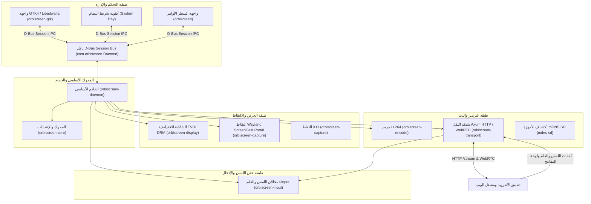

# مواصفات معمارية النظام - Orbiscreen

---

## 🌐 اللغة

<a href="ARCHITECTURE.md">🇬🇧 English</a> · <a href="ARCHITECTURE_AR.md">🇸🇦 العربية</a>

---

## 🏛 الهيكل المعماري للنظام

بُني مشروع **Orbiscreen** كمنظومة برمجية قياسية مقسمة على عدة حزم (Rust Workspace) لفصل محركات الشاشات، والالتقاط، والترميز، والتواصل عبر D-Bus، وبروتوكولات النقل الشبكي:

---

## 📦 توزيع الحزم ومسؤولياتها

| الحزمة | المسؤولية | المكتبات الرئيسية |
|-------|----------------|------------------|
| `orbiscreen-core` | الإعدادات المشتركة، أنواع الأخطاء، الترميز | `serde`, `toml` |
| `orbiscreen-display` | إنشاء الشاشات الافتراضية EVDI وتوليد EDID | `evdi`, `libc` |
| `orbiscreen-capture` | التقاط الشاشة عبر Wayland Portal و X11 | `ashpd`, `x11rb` |
| `orbiscreen-encode` | خطوط ترميز الفيديو H.264 بالعتاد والبرمجيات | `gstreamer`, `gstreamer-app` |
| `orbiscreen-input` | حقن أحداث اللمس والقلم ولوحة المفاتيح في النواة | `evdevil`, `nix` |
| `orbiscreen-transport` | بث `/stream` عبر Axum و WebRTC و ADB reverse | `axum`, `webrtc`, `tokio` |
| `orbiscreen-daemon` | الملف التنفيذي للخدمة وتوفير واجهة D-Bus | `zbus`, `clap`, `tokio` |
| `orbiscreen-gtk` | لوحة التحكم الرسومية بسطح المكتب GTK4 / Libadwaita | `gtk4`, `libadwaita`, `zbus` |
