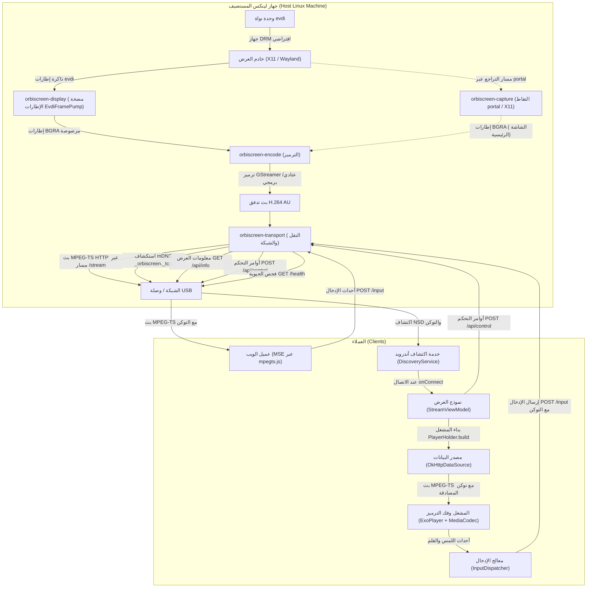

<div align="center">

# مواصفات المعمارية - Orbiscreen

[](../CHANGELOG.md)
[](../LICENSE)


</div>

---

## 🌐 اللغة

<a href="ARCHITECTURE.md">🇬🇧 English</a> · <a href="ARCHITECTURE_AR.md">🇸🇦 العربية</a>

---

بُني Orbiscreen كمساحة عمل Rust متعددة الحزم (crates) نمطية تفصل بين مشغّلات الشاشة الافتراضية (evdi أساساً مع تراجع portal)، ومُرمَّزات الفيديو المسرَّعة، والاتصال بين العمليات (D-Bus)، ونقل MPEG-TS عبر HTTP مع توكن جلسة.

---

## 🏛 نظرة عامة على معمارية النظام


```mermaid
graph TD
    subgraph "جهاز لينكس المستضيف (Host Linux Machine)"
        A["وحدة نواة evdi"] -->|"جهاز DRM افتراضي"| B["خادم العرض (X11 / Wayland)"]
        B -->|"ذاكرة إطارات evdi"| C1["orbiscreen-display (مضخة الإطارات EvdiFramePump)"]
        B -.->|"مسار التراجع عبر portal"| C0["orbiscreen-capture (التقاط portal / X11)"]
        C1 -->|"إطارات BGRA مرصوصة"| D["orbiscreen-encode (الترميز)"]
        C0 -.->|"إطارات BGRA (الشاشة الرئيسية)"| D
        D -->|"ترميز GStreamer عتادي/برمجي"| E["بث تدفق H.264 AU"]
        E --> F["orbiscreen-transport (النقل والشبكة)"]
        F -->|"بث MPEG-TS HTTP عبر مسار /stream"| G["الشبكة / وصلة USB"]
        F -->|"استكشاف mDNS _orbiscreen._tcp."| G
        F -->|"معلومات العرض GET /api/info"| G
        F -->|"أوامر التحكم POST /api/control"| G
        F -->|"فحص الحيوية GET /health"| G
    end

    subgraph "العملاء (Clients)"
        G -->|"بث MPEG-TS مع التوكن"| W["عميل الويب (MSE عبر mpegts.js)"]
        W -->|"أحداث الإدخال POST /input"| F
        G -->|"اكتشاف NSD والتوكن"| H["خدمة اكتشاف أندرويد (DiscoveryService)"]
        H -->|"عند الاتصال onConnect"| J["نموذج العرض (StreamViewModel)"]
        J -->|"بناء المشغل PlayerHolder.build"| K["مصدر البيانات (OkHttpDataSource)"]
        K -->|"بث MPEG-TS مع توكن المصادقة"| L["المشغل وفك الترميز (ExoPlayer + MediaCodec)"]
        L -->|"أحداث اللمس والقلم"| N["معالج الإدخال (InputDispatcher)"]
        N -->|"إرسال الإدخال POST /input مع التوكن"| F
        J -->|"أوامر التحكم POST /api/control"| F
    end
```

---

<h2 dir="rtl" align="right">&rlm;📦 طوبولوجيا حزم مساحة العمل</h2>

<div dir="rtl" align="right">

| الحزمة | المسؤولية | التبعيات الرئيسية |
| :--- | :--- | :--- |
| `orbiscreen-core` | الإعدادات المشتركة وأنواع الأخطاء والتسلسل | `serde`، `toml` |
| `orbiscreen-display` | إنشاء شاشة افتراضية &rlm;EVDI DRM&rlm; وتوليف &rlm;EDID | `evdi`، `libc` |
| `orbiscreen-capture` | محركات الالتقاط عبر &rlm;Wayland Portal (ashpd)&rlm; و &rlm;X11 (x11rb) | `ashpd`، `x11rb` |
| `orbiscreen-encode` | خطوط أنابيب ترميز &rlm;H.264&rlm; عتادية وبرمجية | `gstreamer`، `gstreamer-app` |
| `orbiscreen-input` | حقن اللمس العكسي والقلم ولوحة المفاتيح | `evdevil`، `nix` |
| `orbiscreen-transport` | خادم &rlm;Axum HTTP&rlm; على مسار `/stream`، واكتشاف &rlm;mDNS&rlm;، ونفق &rlm;ADB reverse&rlm;، ونقاط `/api/*` و `/health` | `axum`، `gstreamer`، `tokio` |
| `orbiscreen-daemon` | ثنائي الـ &rlm;daemon&rlm; الرئيسي، تكامل &rlm;systemd&rlm; وخدمة &rlm;D-Bus | `zbus`، `clap`، `tokio` |

</div>

---

<h2 dir="rtl" align="right">&rlm;📱 بنية حزم عميل Android</h2>

<div dir="rtl" align="right">
```
com.orbiscreen.android/
├── MainActivity.kt                # مستضيف Compose، يراقب تدفق سمات PrefsStore.themePrefFlow
├── data/
│   └── PrefsStore.kt              # SharedPreferences (المضيف الأخير، السمة، مفتاح المسح)
├── net/
│   ├── DiscoveryService.kt        # غلاف NsdManager نحو تدفق StateFlow لقائمة المضيفين
│   ├── SubnetScanner.kt           # مسح شبكة /24 مع توازي محدد بـ Semaphore
│   ├── HostApi.kt                 # عميل OkHttp لنقاط /api/info و /api/control و /health
│   ├── WifiGatewayProvider.kt     # يقرأ بوابة WifiManager.dhcpInfo.gateway
│   └── DiscoveryModel.kt          # التحقق من تعبير HostSpec النمطي
├── player/
│   ├── PlayerHolder.kt            # مشغل ExoPlayer مع OkHttpDataSource و DefaultLoadControl
│   └── StreamUrl.kt               # يبني رابط البث http://host:port/stream?token=...
├── input/
│   └── InputDispatcher.kt         # معالج أحداث المؤشر / العجلة / المفاتيح / القلم بإحداثيات مطلقة
└── ui/
    ├── theme/                     # ألوان وسمات وخطوط واجهة Material 3 (Color.kt, Theme.kt, Type.kt)
    ├── nav/OrbiNav.kt             # مضيف التنقل NavHost (الاستكشاف / البث / الإعدادات)
    ├── discovery/                 # شاشة الاستكشاف ونموذج العرض
    ├── stream/                    # شاشة البث وسطح العرض وشريط التحكم
    └── settings/                  # شاشة الإعدادات (السمة، فك الترميز، الماسح، المضيف الأخير)
```

| المسار / المكون | الوصف والوظيفة |
| :--- | :--- |
| `com.orbiscreen.android/` | الحزمة الأساسية لعميل أندرويد |
| ├── `MainActivity.kt` | مستضيف Compose، يراقب تدفق سمات `PrefsStore.themePrefFlow` |
| ├── `data/` | طبقة البيانات والتخزين المحلي |
| │   └── `PrefsStore.kt` | التفضيلات المشتركة (&rlm;SharedPreferences&rlm;: المضيف الأخير، السمة، مفتاح المسح) |
| ├── `net/` | طبقة الاتصال الشبكي والاكتشاف التلقائي |
| │   ├── `DiscoveryService.kt` | غلاف `NsdManager` نحو تدفق `StateFlow<Map<DiscoveredHost>>` |
| │   ├── `SubnetScanner.kt` | مسح شبكة /24 مع توازي محدد بـ `Semaphore` |
| │   ├── `HostApi.kt` | عميل `OkHttp` لنقاط `/api/info` و `/api/control` و `/health` |
| │   ├── `WifiGatewayProvider.kt` | يقرأ بوابة `WifiManager.dhcpInfo.gateway` |
| │   └── `DiscoveryModel.kt` | التحقق من صحة تعبير `HostSpec` النمطي |
| ├── `player/` | طبقة تشغيل وفك ترميز الفيديو |
| │   ├── `PlayerHolder.kt` | مشغل `ExoPlayer` مع `OkHttpDataSource` و `DefaultLoadControl` |
| │   └── `StreamUrl.kt` | يبني رابط البث `http://host:port/stream?token=...` |
| ├── `input/` | طبقة إرسال مدخلات اللمس والفأرة والقلم |
| │   └── `InputDispatcher.kt` | معالج أحداث المؤشر / العجلة / المفاتيح / القلم بإحداثيات مطلقة |
| └── `ui/` | واجهة المستخدم المبنية بـ &rlm;Material 3 Compose |
|     ├── `theme/` | ألوان وسمات وخطوط واجهة &rlm;Material 3 (`Color.kt`, `Theme.kt`, `Type.kt`) |
|     ├── `nav/OrbiNav.kt` | مضيف التنقل `NavHost` (الاستكشاف / البث / الإعدادات) |
|     ├── `discovery/` | شاشة الاستكشاف ونموذج العرض (`DiscoveryScreen` + `DiscoveryViewModel`) |
|     ├── `stream/` | شاشة البث وسطح العرض وشريط التحكم (`StreamScreen`, `PlayerSurface`, `ControlToolbar`) |
|     └── `settings/` | شاشة الإعدادات (السمة، فك الترميز، الماسح، المضيف الأخير) |

</div>

---

## ⚡ خط أنابيب البث

1. **تهيئة الشاشة الافتراضية:**
   - **واجهة XDG Desktop Portal ScreenCast Virtual:** على GNOME 46+ و KDE Plasma 6+، يطلب `orbiscreen-capture` نوع `SourceType::Virtual` لإنشاء مخرج افتراضي حقيقي بدون صلاحيات root عبر PipeWire.
   - **واجهات الـ IPC:** تُنشئ بيئات Sway و Hyprland مخارج headless ديناميكية عبر مقابس التحكم (`$SWAYSOCK` / `hyprctl`).
   - **مشغل EVDI للنواة:** على X11 و COSMIC وجلسات Wayland السابقة، يُهيئ `orbiscreen-display` شاشة DRM افتراضية عبر وحدة EVDI.
   - **التراجع للشاشة الرئيسية:** عند تعذر إنشاء شاشة افتراضية، يتراجع النظام تلقائياً لالتقاط الشاشة الرئيسية عبر portal ScreenCast أو X11 `GetImage`.
2. **التقاط الإطارات:** إطارات BGRA خام من ذاكرة evdi الإطارية (أو PipeWire / X11 Shared Memory في وضع التراجع).
3. **الترميز:**
   - يرمّز `orbiscreen-encode` الإطارات إلى H.264 عبر خطوط أنابيب GStreamer المسرّعة عتادياً (VAAPI ثم NVENC مع التراجع البرمجي إلى x264).
   - يتم ضبط الإطارات المفتاحية (GOP) على 6 إطارات (كل 100ms) للسماح بالاستعادة اللحظية للبث ومنع أي بطء أو تراكم على شبكات Wi-Fi 5GHz.
   - تفريغ فوري لذاكرة AppSink وضبط `drop = true` لمنع طوابير الانتظار.
4. **التشغيل على Android:**
   - تعمل `PlayerHolder.build()` على مشغل ExoPlayer مع `MimeTypes.VIDEO_MP2T` وتخزين مؤقت فائق الانخفاض (40ms أدنى و 120ms أقصى).
   - رصد لحظي لحالة انقطاع الاتصال (`StreamEvent.Disconnected`) وفحص سريع عبر `/health` خلال 500ms مع حد أقصى 3 محاولات لإيقاف حلقات الوميض المتكررة.
5. **الإدخال العكسي:**
   - يربط `InputDispatcher` أحداث المؤشر والعجلة والقلم ولوحة المفاتيح بدقة الشاشة الفعلية مع تقييد صارم للمؤشر داخل حدود الشاشة الافتراضية (عبر XRandR).
   - **لوح الرسم والقلم:** تتبع حركة القلم أثناء التحليق في الهواء (`setOnGenericMotionListener`)، وتصحيح حسابات زوايا الميلان، ودعم 4095 مستوى ضغط مع إرسال خلفي عبر `Dispatchers.IO`.
   - **لوحة اللمس والسحب:** إيماءة النقر المزدوج مع السحب (Double-tap & Drag) لتحريك النوافذ وتحديد النصوص بسهولة.
6. **التحكم بالمضيف:**
   - يُرسل `HostApi.sendControl` إجراءات JSON إلى `/api/control` لطلبات القفل والتعتيم وctrl-alt-del، مع التوكن المعتمد.

---

## 🔐 الأمان والمصادقة

- **تمهيد العملاء:** توفر النقطة `/client/config.json` توكن الجلسة وأبعاد العرض للتمهيد التلقائي لعملاء الويب وتطبيقات الشبكة المحلية.
- **مصادقة المتصفحات البعيدة:** تدعم متصفحات الويب المصادقة الآمنة عبر تجزئة الرابط (`#token=<SECRET>`) أو الاستعلام (`?token=`) دون تسريب التوكن في سجلات الخادم.
- **حماية ملف التوكن:** يُحفظ التوكن في `~/.config/orbiscreen/stream_token` بصلاحيات صارمة `0o600` والمجلدات `0o700`.
- **حماية النقاط:** يُطلب التوكن إجبارياً على نقاط `/stream` و `/input` و `/api/control` عبر الترويسة `Authorization: Bearer <token>` أو الاستعلام `?token=`.

---

<h2 dir="rtl" align="right">&rlm;🌐 عقد واجهة HTTP API</h2>

<div dir="rtl" align="right">

| النقطة | الطريقة | المصادقة | الاستجابة |
| :--- | :---: | :---: | :--- |
| `/stream` | `GET` | توكن | بث فيديو &rlm;MPEG-TS (`video/mp2t`)&rlm; |
| `/health` | `GET` | عامة | &rlm;`200 OK "ok"`&rlm; |
| `/api/info` | `GET` | عامة | معلومات العرض والترميز والإصدار بصيغة &rlm;JSON&rlm; |
| `/api/control` | `POST` | توكن | &rlm;`200 OK`&rlm;؛ الإجراءات: `lock`، `blank`، `unblank`، `ctrl_alt_del` |
| `/client/config.json` | `GET` | عامة | إعدادات تمهيد العميل والتوكن |

</div>

أحداث الإدخال (`/input`، تتطلب توكن) تقبل مخطط الحمولة المستخدم لدى عميل الويب: `Move{x,y}`، `Button{button,pressed,x?,y?}`، `Wheel{delta_y}`، `Key{code,pressed}`، `Stylus{x,y,pressure,tilt_x_deg,tilt_y_deg}`.

---

## 🔌 تحسينات النقل

- **قفزات مفتاحية متقاربة (GOP 6):** توليد إطار مفتاحي كل 100ms يضمن التزامن اللحظي حتى في حال فقدان حزم البيانات عبر شبكات Wi-Fi 5GHz.
- **توجيه نفق ADB لأجهزة Chromebook (ARC++):** استكشاف تلقائي للعنوان الداخلي `100.115.92.2:5555` لتشغيل البث فورياً عبر USB.
- **OkHttpDataSource:** مهلة قراءة صفرية، مقبس طويل العمر، و`User-Agent: Orbiscreen-Android/1.0` مخصص لسجلات خادم أوضح.
- **DefaultLoadControl فائق الاستجابة:** تخزين مؤقت بين 40ms و 120ms لضمان أدنى كمون ممكن وتفادي أي تراكم للمشاهد.
- **قناة البث:** `video_tx` هو `tokio::sync::broadcast` بحيث يمكن لعدة عملاء الاشتراك في نفس البث المرمّز دون ضغط عكسي على المُرمّز.
- **بلا Protobuf:** تستخدم الحمولات `org.json.JSONObject` في كلا الاتجاهين للحفاظ على عقد سلكي متماثل مع عميل الويب.

---

## 🔁 دورة الحياة

- يمتلك `StreamViewModel` كائن `PlayerHolder`؛ يحدث التحرير داخل `onCleared()`.
- يُنشأ `InputDispatcher` كسولاً عند أول لمسة ويُحرَّر مع المشغّل.
- يبدأ `DiscoveryService` في `DiscoveryViewModel.init` ويُفصل مع نطاق ViewModel.

---

<div align="center">

بُني بواسطة <a href="https://github.com/shadow-x78">shadow-x78</a> ·
[العودة إلى README](../README_AR.md)

<sub>&copy; 2026 Orbiscreen (shadow-x78)</sub>

</div>
