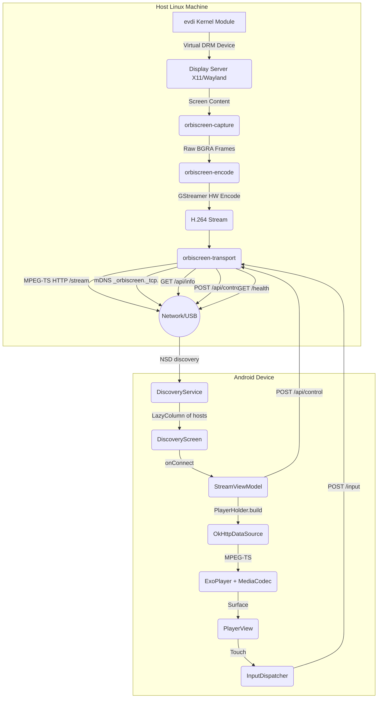

# مواصفات المعمارية - Orbiscreen

> ينطبق على **v0.10.3** والإصدارات الأحدث.

بُني Orbiscreen كمساحة عمل Rust متعددة الحزم (crates) نمطية تفصل بين مشغّلات شاشات النظام، ومحركات التقاط الإطارات، ومُرمّزات الفيديو المسرَّعة عتادياً، والاتصال بين العمليات (D-Bus)، ونواقل الشبكة متعددة البروتوكولات.

---

## 🏛 نظرة عامة على معمارية النظام


```mermaid
graph TD
    subgraph Host Linux Machine
        A[evdi Kernel Module] -->|Virtual DRM Device| B(Display Server X11/Wayland)
        B -->|Screen Content| C(orbiscreen-capture)
        C -->|Raw BGRA Frames| D(orbiscreen-encode)
        D -->|GStreamer HW Encode| E(H.264 Stream)
        E --> F(orbiscreen-transport)
        F -->|MPEG-TS HTTP /stream| G((Network/USB))
        F -->|mDNS _orbiscreen._tcp.| G
        F -->|GET /api/info| G
        F -->|POST /api/control| G
        F -->|GET /health| G
    end

    subgraph Android Device
        G -->|NSD discovery| H(DiscoveryService)
        H -->|LazyColumn of hosts| I(DiscoveryScreen)
        I -->|onConnect| J(StreamViewModel)
        J -->|PlayerHolder.build| K(OkHttpDataSource)
        K -->|MPEG-TS| L(ExoPlayer + MediaCodec)
        L -->|Surface| M(PlayerView)
        M -->|Touch| N(InputDispatcher)
        N -->|POST /input| F
        J -->|POST /api/control| F
    end
```

---

## 📦 طوبولوجيا حزم مساحة العمل

| الحزمة | المسؤولية | التبعيات الرئيسية |
|-------|----------------|------------------|
| `orbiscreen-core` | الإعدادات المشتركة وأنواع الأخطاء والتسلسل | `serde`، `toml` |
| `orbiscreen-display` | إنشاء شاشة افتراضية EVDI DRM وتوليف EDID | `evdi`، `libc` |
| `orbiscreen-capture` | محركات التقاط Wayland Portal (ashpd) وX11 (x11rb) | `ashpd`، `x11rb` |
| `orbiscreen-encode` | خطوط أنابيب ترميز H.264 عتادية وبرمجية | `gstreamer`، `gstreamer-app` |
| `orbiscreen-input` | حقن اللمس العكسي والقلم ولوحة المفاتيح | `evdevil`، `nix` |
| `orbiscreen-transport` | Axum HTTP على `/stream`، وmDNS، وADB reverse، و`/api/info`، و`/api/control`، و`/health` | `axum`، `gstreamer`، `tokio` |
| `orbiscreen-daemon` | ثنائي الـ daemon الرئيسي، تكامل systemd وخدمة D-Bus | `zbus`، `clap`، `tokio` |
| `orbiscreen-gtk` | لوحة تحكم سطح مكتب GTK4 / Libadwaita أصلية | `gtk4`، `libadwaita`، `zbus` |

---

## 📱 بنية حزم عميل Android

```
com.orbiscreen.android/
├── MainActivity.kt                # Compose host, observes PrefsStore.themePrefFlow
├── data/
│   └── PrefsStore.kt              # SharedPreferences (recent host, theme, scanner toggle)
├── net/
│   ├── DiscoveryService.kt        # NsdManager wrapper -> StateFlow<Map<DiscoveredHost>>
│   ├── SubnetScanner.kt           # /24 sweep with Semaphore-bounded parallelism
│   ├── HostApi.kt                 # OkHttp client for /api/info, /api/control, /health
│   ├── WifiGatewayProvider.kt     # Reads WifiManager.dhcpInfo.gateway
│   └── DiscoveryModel.kt          # HostSpec regex validator
├── player/
│   ├── PlayerHolder.kt            # ExoPlayer + OkHttpDataSource + DefaultLoadControl
│   └── StreamUrl.kt               # Builds http://host:port/stream.ts?fmt=mp2t
├── input/
│   └── InputDispatcher.kt         # Absolute-coord pointer / wheel / keyboard / stylus
└── ui/
    ├── theme/                     # Material 3 Color.kt, Theme.kt, Type.kt
    ├── nav/OrbiNav.kt             # NavHost (Discovery / Stream / Settings)
    ├── discovery/                 # DiscoveryScreen + DiscoveryViewModel
    ├── stream/                    # StreamScreen, PlayerSurface, ControlToolbar
    └── settings/                  # SettingsScreen (theme, decoder, scanner, recent host)
```

---

## ⚡ خط أنابيب البث Zero-Copy

1. **تهيئة الشاشة الافتراضية:** يخصّص `orbiscreen-display` موصّل DRM افتراضي عبر EVDI (أو يتراجع إلى جلسة ScreenCast في `xdg-desktop-portal`).
2. **التقاط الإطارات:** تُلتقط مخازن الإطارات الخام BGRA عبر PipeWire DMA-BUF / X11 Shared Memory.
3. **الترميز العتادي:**
   - يستهلك `orbiscreen-encode` مخازن إطارات X11 / PipeWire الخام ويرمّزها إلى H.264 باستخدام خطوط أنابيب GStreamer المسرَّعة عتادياً (VAAPI أو NVENC أو التراجع إلى x264).
   - يغلّف `orbiscreen-transport` وحدات NAL المرمّزة بـ H.264 داخل حاوية MPEG-TS ويقدّمها عبر `http://host:port/stream.ts`.
4. **التشغيل على Android:**
   - تعمل `PlayerHolder.build()` على الخيط الرئيسي (`withContext(Dispatchers.Main)`) لمنع انهيارات التنافس الخيطي عند الاتصال.
   - جميع تهيئات builder وdataSource داخل `PlayerHolder.build()` مغلّفة بكتلة try-catch لتظهر أخطاء البناء كبطاقات `StreamEvent.Error` قابلة لإعادة المحاولة.
   - يبني `PlayerHolder` كائن `MediaItem` مع `MimeTypes.VIDEO_MP2T` حتى يفك ExoPlayer ترميز MPEG-TS دون sniffing.
   - يُضبط `OkHttpDataSource` بمهلة قراءة صفرية (بث مباشر) و`DefaultLoadControl` مضبوط (تخزين 1.5 ثوانٍ أدنى / 5 ثوانٍ أقصى).
   - يكشف `PlayerHolder` واجهة `Player.Listener` تربط حالات `Player.STATE_*` بأحداث `StreamEvent` لواجهة Compose.
5. **الإدخال العكسي:**
   - يربط `InputDispatcher` أحداث المؤشر / العجلة / القلم / لوحة المفاتيح من مستطيل `PlayerView` في Android بإحداثيات مطلقة للمضيف باستخدام دقة الشاشة المُبلَّغ عنها من `/api/info`.
   - تُزال تكرارات الأحداث عبر `MutableSharedFlow` مع `BufferOverflow.DROP_OLDEST` لمنع التراكم أثناء السحب السريع.
6. **التحكم بالمضيف:**
   - يُرسل `HostApi.sendControl` إجراءات JSON إلى `/api/control` لطلبات القفل والتعتيم وctrl-alt-del ومدير الملفات.

---

## 🌐 عقد HTTP API

| النقطة | الطريقة | الجسم | الاستجابة |
|----------|--------|------|----------|
| `/stream` | GET | — | بث `video/mp2t` MPEG-TS |
| `/health` | GET | — | `200 OK "ok"` |
| `/api/info` | GET | — | `{"display_width":1920,"display_height":1080,"refresh_hz":60,"encoder":"x264","version":"0.10.2"}` |
| `/api/control` | POST | `{"action":"lock"\|"blank\|"unblank"\|"ctrl_alt_del"\|"open","state":"on\|off","target":"files"}` | `200 OK` |

أحداث الإدخال (`/input`) تقبل نفس مخطط الحمولة المستخدم لدى عميل الويب الحالي: `Move{x,y}`، `Button{button,pressed,x?,y?}`، `Wheel{deltaY}`، `Key{code,pressed}`، `Stylus{x,y,pressure,tilt_x,tilt_y}`.

---

## 🔌 تحسينات النقل

- **OkHttpDataSource:** مهلة قراءة صفرية، مقبس طويل العمر، و`User-Agent: Orbiscreen-Android/1.0` مخصص لسجلات خادم أوضح.
- **DefaultLoadControl:** يخزّن 1.5 ثانية كحد أدنى و5 ثوانٍ كحد أقصى لامتصاص اضطراب Wi-Fi دون استنزاف RAM.
- **قناة البث:** `video_tx` هو `tokio::sync::broadcast` بحيث يمكن لعدة عملاء HTTP الاشتراك في نفس البث المرمّز دون ضغط عكسي على المُرمّز.
- **بلا Protobuf:** تستخدم الحمولات `org.json.JSONObject` في كلا الاتجاهين للحفاظ على عقد سلكي متماثل مع عميل الويب.

---

## 🔁 دورة الحياة

- يمتلك `StreamViewModel` كائن `PlayerHolder`؛ يحدث التحرير داخل `onCleared()`.
- يُنشأ `InputDispatcher` كسولاً عند أول لمسة ويُحرَّر مع المشغّل.
- يبدأ `DiscoveryService` في `DiscoveryViewModel.init` ويُفصل مع نطاق ViewModel.

---

<div align="center">

بُني بواسطة <a href="https://github.com/shadow-x78">shadow-x78</a> ·
[العودة إلى README](../README_AR.md)

<sub>&copy; 2026 Orbiscreen (shadow-x78)</sub>

</div>
