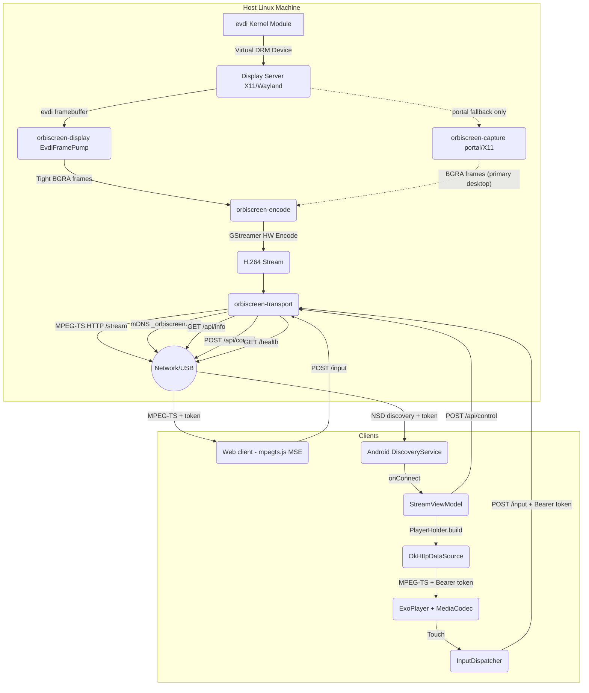

<div align="center">

# مواصفات المعمارية - Orbiscreen

[](../CHANGELOG.md)
[](../LICENSE)


</div>

---

## 🌐 اللغة

<a href="ARCHITECTURE.md">🇬🇧 English</a> · <a href="ARCHITECTURE_AR.md">🇸🇦 العربية</a>

---

بُني Orbiscreen كمساحة عمل Rust متعددة الحزم (crates) نمطية تفصل بين مشغّلات الشاشة الافتراضية (evdi أساساً مع تراجع portal)، ومُرمَّزات الفيديو المسرَّعة، والاتصال بين العمليات (D-Bus)، ونقل MPEG-TS عبر HTTP مع توكن جلسة.

---

## 🏛 نظرة عامة على معمارية النظام


```mermaid
graph TD
    subgraph Host Linux Machine
        A[evdi Kernel Module] -->|Virtual DRM Device| B(Display Server X11/Wayland)
        B -->|evdi framebuffer| C1(orbiscreen-display EvdiFramePump)
        B -.->|portal fallback only| C0(orbiscreen-capture portal/X11)
        C1 -->|Tight BGRA frames| D(orbiscreen-encode)
        C0 -.->|"BGRA frames (primary desktop)"| D
        D -->|GStreamer HW Encode| E(H.264 Stream)
        E --> F(orbiscreen-transport)
        F -->|MPEG-TS HTTP /stream| G((Network/USB))
        F -->|mDNS _orbiscreen._tcp.| G
        F -->|GET /api/info| G
        F -->|POST /api/control| G
        F -->|GET /health| G
    end

    subgraph Clients
        G -->|MPEG-TS + token| W(Web client - mpegts.js MSE)
        W -->|POST /input| F
        G -->|NSD discovery + token| H(Android DiscoveryService)
        H -->|onConnect| J(StreamViewModel)
        J -->|PlayerHolder.build| K(OkHttpDataSource)
        K -->|MPEG-TS + Bearer token| L(ExoPlayer + MediaCodec)
        L -->|Touch| N(InputDispatcher)
        N -->|POST /input + Bearer token| F
        J -->|POST /api/control| F
    end
```

---

<h2 dir="rtl" align="right">&rlm;📦 طوبولوجيا حزم مساحة العمل</h2>

<div dir="rtl" align="right">

| الحزمة | المسؤولية | التبعيات الرئيسية |
| :--- | :--- | :--- |
| `orbiscreen-core` | الإعدادات المشتركة وأنواع الأخطاء والتسلسل | `serde`، `toml` |
| `orbiscreen-display` | إنشاء شاشة افتراضية &rlm;EVDI DRM&rlm; وتوليف &rlm;EDID | `evdi`، `libc` |
| `orbiscreen-capture` | محركات الالتقاط عبر &rlm;Wayland Portal (ashpd)&rlm; و &rlm;X11 (x11rb) | `ashpd`، `x11rb` |
| `orbiscreen-encode` | خطوط أنابيب ترميز &rlm;H.264&rlm; عتادية وبرمجية | `gstreamer`، `gstreamer-app` |
| `orbiscreen-input` | حقن اللمس العكسي والقلم ولوحة المفاتيح | `evdevil`، `nix` |
| `orbiscreen-transport` | خادم &rlm;Axum HTTP&rlm; على مسار `/stream`، واكتشاف &rlm;mDNS&rlm;، ونفق &rlm;ADB reverse&rlm;، ونقاط `/api/*` و `/health` | `axum`، `gstreamer`، `tokio` |
| `orbiscreen-daemon` | ثنائي الـ &rlm;daemon&rlm; الرئيسي، تكامل &rlm;systemd&rlm; وخدمة &rlm;D-Bus | `zbus`، `clap`، `tokio` |

</div>

---

<h2 dir="rtl" align="right">&rlm;📱 بنية حزم عميل Android</h2>

```
com.orbiscreen.android/
├── MainActivity.kt                # مستضيف Compose، يراقب تدفق سمات PrefsStore.themePrefFlow
├── data/
│   └── PrefsStore.kt              # SharedPreferences (المضيف الأخير، السمة، مفتاح المسح)
├── net/
│   ├── DiscoveryService.kt        # غلاف NsdManager نحو تدفق StateFlow لقائمة المضيفين
│   ├── SubnetScanner.kt           # مسح شبكة /24 مع توازي محدد بـ Semaphore
│   ├── HostApi.kt                 # عميل OkHttp لنقاط /api/info و /api/control و /health
│   ├── WifiGatewayProvider.kt     # يقرأ بوابة WifiManager.dhcpInfo.gateway
│   └── DiscoveryModel.kt          # التحقق من تعبير HostSpec النمطي
├── player/
│   ├── PlayerHolder.kt            # مشغل ExoPlayer مع OkHttpDataSource و DefaultLoadControl
│   └── StreamUrl.kt               # يبني رابط البث http://host:port/stream?token=...
├── input/
│   └── InputDispatcher.kt         # معالج أحداث المؤشر / العجلة / المفاتيح / القلم بإحداثيات مطلقة
└── ui/
    ├── theme/                     # ألوان وسمات وخطوط واجهة Material 3 (Color.kt, Theme.kt, Type.kt)
    ├── nav/OrbiNav.kt             # مضيف التنقل NavHost (الاستكشاف / البث / الإعدادات)
    ├── discovery/                 # شاشة الاستكشاف ونموذج العرض
    ├── stream/                    # شاشة البث وسطح العرض وشريط التحكم
    └── settings/                  # شاشة الإعدادات (السمة، فك الترميز، الماسح، المضيف الأخير)
```

---

## ⚡ خط أنابيب البث

1. **تهيئة الشاشة الافتراضية:** يفتح `orbiscreen-display` شاشة افتراضية EVDI DRM ويقرأ ذاكرتها الإطارية مباشرة (EvdiFramePump) - هذه هي الشاشة الثانية الحقيقية التي يرسم عليها المنشئ. إذا غابت وحدة النواة يتراجع الدامن إلى التقاط سطح المكتب الرئيسي عبر portal (Wayland) أو جذر X11.
2. **التقاط الإطارات:** إطارات BGRA خام من ذاكرة evdi الإطارية (أو PipeWire / X11 Shared Memory في وضع التراجع).
3. **الترميز:**
   - يرمَّز `orbiscreen-encode` الإطارات إلى H.264 عبر خطوط أنابيب GStreamer المسرَّعة عتادياً (أوالاً VAAPI ثم NVENC ثم التراجع إلى x264).
   - لكل عميل يغلّف `orbiscreen-transport` وحدات NAL المرمَّزة بـ H.264 في خط `h264parse + mpegtsmux` مستقل ويقدّمها عبر `http://host:port/stream?token=...`.
4. **التشغيل على Android:**
   - تعمل `PlayerHolder.build()` على الخيط الرئيسي (`withContext(Dispatchers.Main)`) لمنع انهيارات التنافس الخيطي عند الاتصال.
   - جميع تهيئات builder وdataSource داخل `PlayerHolder.build()` مغلّفة بكتلة try-catch لتظهر أخطاء البناء كبطاقات `StreamEvent.Error` قابلة لإعادة المحاولة.
   - يبني `PlayerHolder` كائن `MediaItem` مع `MimeTypes.VIDEO_MP2T` حتى يفك ExoPlayer ترميز MPEG-TS دون sniffing.
   - يُضبط `OkHttpDataSource` بمهلة قراءة صفرية (بث مباشر) و`DefaultLoadControl` مضبوط (تخزين 1.5 ثوانٍ أدنى / 5 ثوانٍ أقصى).
   - يكشف `PlayerHolder` واجهة `Player.Listener` تربط حالات `Player.STATE_*` بأحداث `StreamEvent` لواجهة Compose.
5. **الإدخال العكسي:**
   - يربط `InputDispatcher` أحداث المؤشر / العجلة / القلم / لوحة المفاتيح من مستطيل `PlayerView` في Android بإحداثيات مطلقة للمضيف باستخدام دقة الشاشة المُبلَّغ عنها من `/api/info`.
   - تُزال تكرارات الأحداث عبر `MutableSharedFlow` مع `BufferOverflow.DROP_OLDEST` لمنع التراكم أثناء السحب السريع.
6. **التحكم بالمضيف:**
   - يُرسل `HostApi.sendControl` إجراءات JSON إلى `/api/control` لطلبات القفل والتعتيم وctrl-alt-del، مع توكن الجلسة المنتزَع من الـ TXT المُعلن عبر mDNS.

---

<h2 dir="rtl" align="right">&rlm;🌐 عقد واجهة HTTP API</h2>

<div dir="rtl" align="right">

| النقطة | الطريقة | المصادقة | الاستجابة |
| :--- | :---: | :---: | :--- |
| `/stream` | `GET` | توكن | بث فيديو &rlm;MPEG-TS (`video/mp2t`)&rlm; |
| `/health` | `GET` | عامة | &rlm;`200 OK "ok"`&rlm; |
| `/api/info` | `GET` | عامة | معلومات العرض والترميز والإصدار بصيغة &rlm;JSON&rlm; |
| `/api/control` | `POST` | توكن | &rlm;`200 OK`&rlm;؛ الإجراءات: `lock`، `blank`، `unblank`، `ctrl_alt_del` |
| `/client/config.json` | `GET` | عامة | تمهيد عميل الويب: التوكن وأبعاد الشاشة |

</div>

أحداث الإدخال (`/input`، تتطلب توكن) تقبل مخطط الحمولة المستخدم لدى عميل الويب: `Move{x,y}`، `Button{button,pressed,x?,y?}`، `Wheel{delta_y}`، `Key{code,pressed}`، `Stylus{x,y,pressure,tilt_x_deg,tilt_y_deg}`. يُقدم التوكن عبر ترويسة `Authorization: Bearer <token>` أو معامل `?token=`.

---

## 🔌 تحسينات النقل

- **OkHttpDataSource:** مهلة قراءة صفرية، مقبس طويل العمر، و`User-Agent: Orbiscreen-Android/1.0` مخصص لسجلات خادم أوضح.
- **DefaultLoadControl:** يخزّن 1.5 ثانية كحد أدنى و5 ثوانٍ كحد أقصى لامتصاص اضطراب Wi-Fi دون استنزاف RAM.
- **قناة البث:** `video_tx` هو `tokio::sync::broadcast` بحيث يمكن لعدة عملاء HTTP الاشتراك في نفس البث المرمّز دون ضغط عكسي على المُرمّز.
- **بلا Protobuf:** تستخدم الحمولات `org.json.JSONObject` في كلا الاتجاهين للحفاظ على عقد سلكي متماثل مع عميل الويب.

---

## 🔁 دورة الحياة

- يمتلك `StreamViewModel` كائن `PlayerHolder`؛ يحدث التحرير داخل `onCleared()`.
- يُنشأ `InputDispatcher` كسولاً عند أول لمسة ويُحرَّر مع المشغّل.
- يبدأ `DiscoveryService` في `DiscoveryViewModel.init` ويُفصل مع نطاق ViewModel.

---

<div align="center">

بُني بواسطة <a href="https://github.com/shadow-x78">shadow-x78</a> ·
[العودة إلى README](../README_AR.md)

<sub>&copy; 2026 Orbiscreen (shadow-x78)</sub>

</div>
