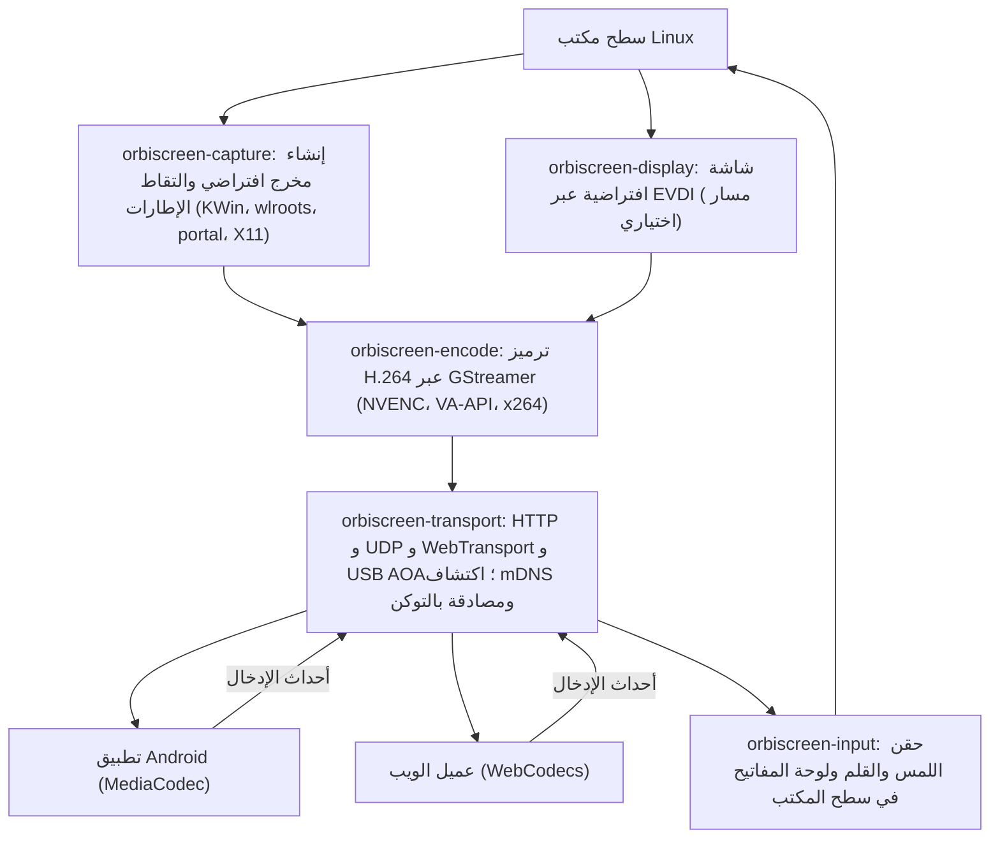

<div align="center">

# مواصفات المعمارية - Orbiscreen

[](../CHANGELOG.md)
[](../LICENSE)


</div>

---

## اللغة

<a href="ARCHITECTURE.md">🇬🇧 English</a> · <a href="ARCHITECTURE_AR.md">🇸🇦 العربية</a>

---

بُني Orbiscreen كمساحة عمل Rust متعددة الحزم (crates) نمطية تفصل بين إنشاء الشاشات الافتراضية، ومحركات التقاط الإطارات، ومُرمَّزات الفيديو المسرَّعة عتادياً، وحَقن الإدخال العكسي، والنقل الشبكي متعدد البروتوكولات (HTTP و UDP و WebTransport و USB AOA).

---

## نظرة عامة على معمارية النظام

عملية واحدة (daemon) على مضيف Linux وعدد غير محدود من العملاء. الفيديو يتدفق في اتجاه واحد (من المضيف إلى العميل) والإدخال يعود في الاتجاه المعاكس:


```mermaid
flowchart TD
    DESK["سطح مكتب Linux"]
    CAP["orbiscreen-capture: إنشاء مخرج افتراضي والتقاط الإطارات (KWin، wlroots، portal، X11)"]
    EVDI["orbiscreen-display: شاشة افتراضية عبر EVDI (مسار اختياري)"]
    ENC["orbiscreen-encode: ترميز H.264 عبر GStreamer (NVENC، VA-API، x264)"]
    TR["orbiscreen-transport: HTTP و UDP و WebTransport و USB AOA؛ اكتشاف mDNS ومصادقة بالتوكن"]
    IN["orbiscreen-input: حقن اللمس والقلم ولوحة المفاتيح في سطح المكتب"]
    AND["تطبيق Android (MediaCodec)"]
    WEB["عميل الويب (WebCodecs)"]

    DESK --> CAP
    DESK --> EVDI
    CAP --> ENC
    EVDI --> ENC
    ENC --> TR
    TR --> AND
    TR --> WEB
    AND -->|أحداث الإدخال| TR
    WEB -->|أحداث الإدخال| TR
    TR --> IN
    IN --> DESK
```

نفس الدورة موصوفة بالكلمات:

1. تُنشأ الشاشة الافتراضية عبر `orbiscreen-capture` (مخرج KWin الافتراضي، أو مخرج wlroots headless، أو مخرج portal الافتراضي) أو عبر `orbiscreen-display` (مسار نواة EVDI).
2. يلتقط `orbiscreen-capture` (أو مضخة إطارات EVDI) الإطارات من ذلك المخرج.
3. يحوّل `orbiscreen-encode` الإطارات من صيغة BGRA إلى H.264 بالمرمّزات العتادية.
4. يوزّع `orbiscreen-transport` البث على Android (UDP Annex-B، و USB AOA Annex-B، مع تراجع HTTP MPEG-TS) وعلى المتصفحات (WebTransport Annex-B).
5. تُرسل العملاء أحداث الإدخال عائِدة عبر `orbiscreen-transport`.
6. يحقن `orbiscreen-input` تلك الأحداث في سطح المكتب (uinput، أو XTEST، أو أجهزة wlroots الافتراضية، أو portal RemoteDesktop).

تربط عملية `orbiscreen-daemon` جميع الحزم ببعضها وتوفّر خدمة D-Bus؛ واجهة سطح المكتب (`orbiscreen-gui` بتقنية Tauri v2) وواجهة الأوامر تتحدثان معها عبر D-Bus.

---

<h2 dir="rtl" align="right">&rlm;طوبولوجيا حزم مساحة العمل</h2>

<div dir="rtl" align="right">

| الحزمة | المسؤولية | التبعيات الرئيسية |
| :--- | :--- | :--- |
| `orbiscreen-core` | الإعدادات المشتركة وأنواع الأخطاء والتسلسل ومسارات الملفات (الإعداد والتوكن) | `serde`، `toml`، `thiserror` |
| `orbiscreen-display` | شاشة EVDI الافتراضية على مستوى النواة: موصل DRM، وتوليف EDID، ومضخة الإطار من الذاكرة الإطارية إلى BGRA ‏(`EvdiFramePump`) | `evdi`، `drm-fourcc`، `tokio` |
| `orbiscreen-capture` | إنشاء المخارج الافتراضية (KWin عبر `zkde-screencast`، و wlroots عبر IPC) بالإضافة إلى التقاط الإطارات: portal ‏(ashpd/PipeWire)‏، و wlr-screencopy، و X11 ‏(x11rb)‏، ومضخة الـ damage، وكشف قدرات النظام | `ashpd`، `x11rb`، `wayland-*`، `orbiscreen-core` |
| `orbiscreen-encode` | خطوط أنابيب ترميز H.264: ‏NVENC و VA-API و x264 البرمجي، مع ضبط VBV و GOP لزمن استجابة منخفض | `gstreamer`، `gstreamer-app`، `orbiscreen-core` |
| `orbiscreen-input` | حقن الإدخال العكسي: شاشة لمس وألواح مفاتيح عبر uinput، و XTEST، وأجهزة wlroots الافتراضية (virtual-pointer / virtual-keyboard)، و portal RemoteDesktop | `evdevil`، `ashpd`، `orbiscreen-core` |
| `orbiscreen-transport` | كل واجهات العملاء: نقاط HTTP ‏(`/stream` و `/input` و `/api/*` و `/health`)‏، و UDP Annex-B مع تصحيح أخطاء Reed-Solomon، و WebTransport Annex-B ‏(`wt_port`)‏، وبث USB عبر AOA، وإعلان mDNS، والاقتران، والمصادقة بالتوكن، وتوجيه جلسات العرض لكل عميل | `axum`، `mdns-sd`، `wtransport`، `gstreamer`، `orbiscreen-core`، `orbiscreen-input` |
| `orbiscreen-daemon` | الثنائي الرئيسي الذي يربط كل الحزم؛ تكامل systemd؛ خدمة D-Bus ‏(`com.orbiscreen.Daemon`)‏؛ أداة التشخيص `doctor` | `zbus`، `clap`، `tokio` |
| `orbiscreen-gui` | مركز تحكم سطح المكتب (‏Tauri v2)‏: الحالة، والتشغيل والإيقاف، وأزرار الدقة عبر D-Bus | `zbus`، `serde_json` |

</div>

---

<h2 dir="rtl" align="right">&rlm;بنية حزم عميل Android</h2>

<div dir="ltr" align="left">

```
com.orbiscreen.android/
├── MainActivity.kt                # مستضيف Compose، يطبّق السمة من PrefsStore
├── data/
│   ├── PrefsStore.kt              # السمة، المضيف الأخير، مفتاح الماسح
│   └── HostCredentialStore.kt     # تخزين توكنات المضيفين المحفوظة
├── net/
│   ├── DiscoveryService.kt        # اكتشاف NSD ‏(mDNS)‏ نحو تدفق StateFlow للمضيفين
│   ├── SubnetScanner.kt           # مسح شبكة /24 بتوازي محدد بـ Semaphore
│   ├── HostApi.kt                 # عميل HTTP لنقاط config.json و api/info و api/control و health
│   ├── ClientIdentity.kt          # معرّف ثابت لكل جهاز (تجزئة ANDROID_ID)
│   ├── PinnedHostProxy.kt         # التعامل مع شهادات المضيفين الموثوقين
│   ├── UsbLoopback.kt             # مقبس محلي أمام قناة AOA
│   ├── WifiGatewayProvider.kt     # فحص بوابة الشبكة لحاوية ARC++ في ChromeOS
│   └── DiscoveryModel.kt          # تحليل وتعديل مواصفات المضيف
├── player/
│   ├── PlayerHolder.kt            # يختار مسار UDP أو USB أو ExoPlayer حسب النقل المتاح
│   ├── UdpPlayer.kt               # UDP Annex-B نحو MediaCodec
│   ├── UsbPlayer.kt               # AOA Annex-B نحو MediaCodec
│   ├── AuReorder.kt               # إعادة تجميع الحزم وقاعدة "التعليق حتى IDR"
│   ├── Fec.kt / PendingFecStore.kt # تصحيح الأخطاء Reed-Solomon
│   ├── UdpCrypto.kt               # التحقق من أصالة حزم UDP
│   ├── H264.kt / Idr.kt / IdrFrames.kt / AoaFrames.kt # أدوات معالجة تيار H.264
│   ├── StreamStats.kt             # إحصائيات البث (زمن الوصول، عمر الإطار، المعدلات)
│   ├── StreamUrl.kt               # بناء رابط البث مع التوكن
│   └── SurfaceTarget.kt           # إدارة أسطح العرض للمُفكّك
├── input/
│   └── InputDispatcher.kt         # إرسال الإدخال عبر WebSocket أولاً مع تراجع HTTP
├── usb/
│   ├── UsbAccessoryManager.kt     # مصافحة AOA وقراءة/كتابة الملحق
│   ├── AoaAcceptedSocket.kt       # تعريض AOA كمقبض خادم محلي
│   └── UsbPermissionPrompt.kt     # تدفق إذن الملحق
├── updater/
│   └── UpdateManager.kt           # فحص الإصدارات الجديدة وتثبيت APK
└── ui/
    ├── theme/                     # ألوان وسمات Material 3 (لوحة Catppuccin Mocha / Latte)
    ├── nav/OrbiNav.kt             # موجّه التنقل (الاستكشاف / البث / الإعدادات)
    ├── discovery/                 # شاشة الاستكشاف ونموذج العرض
    ├── stream/                    # شاشة البث، سطح المشغل، شريط التحكم، طبقة الإحصائيات،
    │                              # مراقب المضيف، شاشة دخول الشبكة المحلية
    └── settings/                  # شاشة الإعدادات (السمة، فك الترميز، الماسح، المضيفون)
```

</div>

---

<h2 dir="rtl" align="right">&rlm;بنية عميل الويب</h2>

<div dir="ltr" align="left">

```
clients/web/
├── index.html                     # هيكل الصفحة والكانفس وأزرار التحكم
├── app.js                         # جلسة WebTransport وإعادة الاتصال وإرسال الإدخال
├── annexb.js                      # بناء وحدات Annex-B لغرف VideoDecoder
└── stats.js                       # طبقة إحصائيات البث
```

</div>

---

## خط أنابيب البث

1. **تهيئة الشاشة الافتراضية:**
   - **واجهة XDG Desktop Portal ScreenCast Virtual:** على GNOME 46+ و KDE Plasma 6+، يطلب `orbiscreen-capture` نوع `SourceType::Virtual` لإنشاء مخرج افتراضي حقيقي بدون صلاحيات root عبر PipeWire.
   - **واجهات الـ IPC:** تُنشئ بيئات Sway و Hyprland مخارج headless ديناميكية عبر مقابس التحكم (`$SWAYSOCK` / `hyprctl`).
   - **مشغل EVDI للنواة:** على X11 و COSMIC وجلسات Wayland السابقة، يُهيئ `orbiscreen-display` شاشة DRM افتراضية عبر وحدة EVDI.
   - **التراجع للشاشة الرئيسية:** عند تعذر إنشاء شاشة افتراضية، يتراجع النظام تلقائيا ً لالتقاط الشاشة الرئيسية عبر portal ScreenCast أو X11 `GetImage`.
2. **التقاط الإطارات:** إطارات BGRA من المخرج الافتراضي (عبر PipeWire، أو screencopy في wlroots، أو KWin virtual، أو ذاكرة evdi الإطارية).
3. **الترميز:**
   - يرمّز `orbiscreen-encode` الإطارات إلى H.264 عبر خطوط أنابيب GStreamer المسرّعة عتادياً (NVENC أو VA-API مع التراجع البرمجي إلى x264).
   - تُولَّد الإطارات المفتاحية عند الطلب فقط (GOP غير منتهي) مع إعادة إرسال SPS/PPS مع كل إطار IDR ليستطيع العميل المتأخر فك الترميز خلال إطار واحد.
   - تُقيَّد ذاكرة AppSink بـ `drop = true` و `max-buffers = 1` لمنع طوابير الانتظار.
4. **النقل والتشغيل:**
   - **أندرويد عبر Wi-Fi:** يرسل `orbiscreen-transport` وحدات H.264 كحزم UDP Annex-B مع تصحيح Reed-Solomon، ويفكّها `UdpPlayer` على MediaCodec.
   - **أندرويد عبر USB:** تُرسل نفس الوحدات عبر قناة AOA Bulk مباشرة إلى MediaCodec بدون شبكة.
   - **المتصفح:** يفتح عميل الويب جلسة WebTransport ويفك Annex-B عبر WebCodecs `VideoDecoder` على كانفس.
   - **التراجع:** إذا فشل المسار الأصلي، يبقى مسار HTTP MPEG-TS مع ExoPlayer متاحاً.
   - **الانقطاع والاستعادة:** فحص فوري عبر `/health` خلال 500ms مع حد أقصى 3 محاولات إعادة اتصال.
5. **الإدخال العكسي:**
   - تُرسل أحداث المؤشر والعجلة والقلم ولوحة المفاتيح عبر قناة WebSocket (مع تراجع HTTP) وتُربط بدقة الشاشة الفعلية مع تقييد صارم داخل حدود الشاشة الافتراضية.
   - **لوح الرسم والقلم:** تتبع التحليق في الهواء، وزوايا ميلان مصححة، وحتى 4095 مستوى ضغط تُرسل عبر `Dispatchers.IO`.
   - **لوحة اللمس والسحب:** النقر المزدوج مع السحب يحرر زر الفأرة الأيسر تلقائياً عند رفع الإصبع.
6. **التحكم بالمضيف:**
   - يُرسل `HostApi.sendControl` إجراءات JSON إلى `/api/control` لطلبات القفل والتعتيم و ctrl-alt-del، مع التوكن المعتمد.

---

## الأمان والمصادقة

يُولَّد لكل جلسة توكن عشوائي من 32 بايت بترميز base64url عند بدء التشغيل:

- **تمهيد العملاء:** توفر النقطة `/client/config.json` توكن الجلسة وأبعاد العرض للتمهيد التلقائي لعملاء الويب والشبكة المحلية.
- **مصادقة المتصفحات البعيدة:** تدعم المتصفحات المصادقة الآمنة عبر تجزئة الرابط (`#token=<SECRET>`) أو الاستعلام (`?token=`) دون تسريب التوكن في سجلات الخادم.
- **عميل Android:** يستقبل التوكن عبر سجلات mDNS TXT أو بإدخاله يدوياً.
- **حماية الملفات:** يحفظ الـ daemon التوكن في `~/.config/orbiscreen/token` وشهادة WebTransport في `wt-cert.pem` / `wt-key.pem`، وكلها بصلاحيات `0o600` والمجلدات الأب بصلاحيات `0o700`.
- **حماية النقاط:** يٌطلب التوكن إجبارياً على `/stream` و `/input` و `/api/control` عبر ترويسة `Authorization: Bearer <token>` أو الاستعلام `?token=` (بمقارنة بزمن ثابت).
- تبقى `/health` و `/api/info` عامة لكي يعمل الاكتشاف وفحص الحيوية بدون بيانات اعتماد.

---

<h2 dir="rtl" align="right">&rlm;عقد واجهة HTTP API</h2>

<div dir="rtl" align="right">

| النقطة | الطريقة | المصادقة | الوصف |
| :--- | :---: | :---: | :--- |
| `/` | `GET` | عامة | إعادة التوجيه إلى عميل الويب المضمّن |
| `/stream` | `GET` | توكن | بث فيديو MPEG-TS ‏(`video/mp2t`)‏ |
| `/input` | `POST` | توكن | أحداث المؤشر / المفاتيح / القلم بصيغة JSON، الاستجابة `127` |
| `/api/control` | `POST` | توكن | الإجراءات: `lock`، `blank`، `unblank`، `ctrl_alt_del`، `idr`؛ `127` عند النجاح |
| `/api/info` | `GET` | عامة | أبعاد الشاشة ومعدل التحديث والمرمّز والإصدار بصيغة JSON |
| `/health` | `GET` | عامة | `200 OK "ok"` |

</div>

تقبل نقطة `/input` نفس مخطط الحمولة المستخدم لدى عميل الويب: `Pointer` ‏(‏`Move` / `Button` / `Wheel`‏)‏، و `Key` ‏(بترميز مفاتيح evdev‏)‏، و `Stylus` ‏(الإحداثيات والضغط وزوايا الميلان‏).

---

## تحسينات النقل

- **GOP غير منتهي + IDR عند الطلب:** المرمّزات لا تبذر عرضها بإطارات مفتاحية دورية؛ العميل الملتحق حديثاً أو المتأخر يطلب إطار IDR فيستلم SPS/PPS معه ويفك الترميز خلال إطار واحد.
- **تعدد الإرسال لكل عميل:** كل طلب `/stream` يفتح مسار `appsrc → mpegtsmux → appsink` خاصاً به مع `h264parse config-interval=1` لإعادة بث SPS/PPS مع كل إطار مفتاحي.
- **بوابة ARC++ في ChromeOS:** يفحص عميل Android البوابات الداخلية لحاوية ARC++ ‏(`100.115.92.2`، `192.168.233.1`) على منفذ الإشارة؛ أما بث USB نفسه فيتم عبر AOA وليس `adb reverse`.
- **OkHttpDataSource:** مهلة قراءة صفرية، ومقبس طويل العمر، وترويسة `User-Agent: Orbiscreen-Android/1.0` لسجلات خادم أوضح.
- **DefaultLoadControl:** تخزين مؤقت بين 40ms و120ms يبقي العرض عند أحدث إطار ويمنع التراكم.
- **قناة البث:** `video_tx` هي `tokio::sync::broadcast` مقيّدة الحجم؛ العميل البطيء يتخطى إلى الإطار المفتاحي التالي بدل أن يضغط عكسياً على المرمّز.
- **بلا Protobuf:** تستخدم الحمولات `org.json.JSONObject` في كلا الاتجاهين للحفاظ على عقد سلكي متماثل مع عميل الويب.

---

## دورة الحياة

- يمتلك `StreamViewModel` كائن `PlayerHolder`؛ يحدث التحرير داخل `onCleared()`.
- يُنشأ `InputDispatcher` كسولاً عند أول لمسة ويُحرَّر مع المشغّل.
- يبدأ `DiscoveryService` في `DiscoveryViewModel.init` ويُفصل مع نطاق ViewModel.
- تتوقف مضخة الإطارات عند إسقاط المُستقبِل؛ ويُلغي الـ daemon حلقة الالتقاط بأمان عند SIGINT أو إيقاف D-Bus.

---

<div align="center">

بُني بواسطة <a href="https://github.com/shadow-x78">shadow-x78</a> ·
[العودة إلى README](../README_AR.md)

<sub>&copy; 2026 Orbiscreen (shadow-x78)</sub>

</div>
