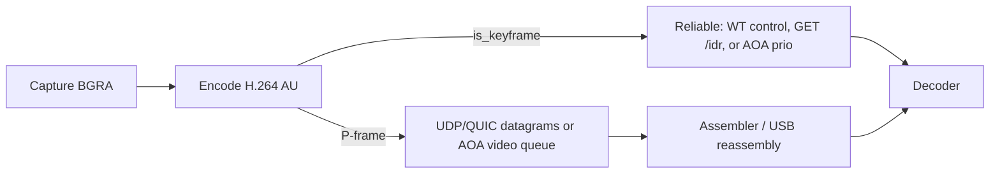

# Frame Transport - Orbiscreen

---

## Language

<a href="FRAME_TRANSPORT.md">English</a>

---

How a coded picture gets from the host encoder to the tablet decoder. Wi-Fi: Android UDP and web WebTransport (packet layouts in [UDP_TRANSPORT.md](UDP_TRANSPORT.md)). USB/AOA: the same Annex-B access units on accessory bulk frames into MediaCodec. HTTP MPEG-TS on `GET /stream` remains only as a USB fallback if the native handshake fails.

---

## 1. Terms

| Term | Meaning here |
| --- | --- |
| **Access unit (AU)** | One coded picture in Annex-B: start codes plus NAL units. The encoder emits AUs; the client decodes AUs. |
| **NAL** | Network Abstraction Layer unit. The useful ones here are SPS (7), PPS (8), non-IDR slice (1), IDR slice (5). |
| **I-frame** | A picture coded only from itself (intra). You can decode *this* picture without another picture. Later P-frames may still refer to pictures *before* this I-frame. |
| **IDR** | Instantaneous Decoder Refresh. A special I-frame that also clears the decoder reference list. Nothing after it may use any frame from before it. That is the recovery point after loss or a new join. |
| **P-frame** | Predicted picture. Needs earlier pictures still in the decoder. Smaller than an IDR. A late P-frame can be dropped; a hole in the P-chain corrupts everything until the next IDR. |
| **Keyframe** | In this codebase, GStreamer's `!DELTA_UNIT` flag. A force-key-unit request is meant to produce an IDR. The reliable stream carries those AUs. |
| **SPS** | Sequence Parameter Set. Profile/level, coded size, the `avc1.…` codec string. Not picture data. |
| **PPS** | Picture Parameter Set. Entropy mode and related defaults. Refers to an SPS by id. |
| **GOP** | Group of pictures: an IDR plus the P-frames that depend on it. Orbiscreen uses an **infinite GOP**: no periodic IDR. Refresh is intra-refresh plus on-demand IDR. |
| **Intra-refresh** | Each P-frame includes a moving strip of intra macroblocks. Over about a second the whole picture is refreshed without a giant IDR. A lost P-frame can heal as the wave passes. |
| **VBV / CPB** | Video / coded picture buffer. Caps how large one AU may be. Orbiscreen sizes this to **one frame** of the CBR target so an IDR cannot occupy hundreds of milliseconds of wire. |
| **Datagram** | Unreliable, unordered-enough packet: UDP, or a WebTransport QUIC datagram. A late frame can be dropped. Loss is an erasure. |
| **Reliable stream** | Ordered, retransmitted bytes: WebTransport control stream, or TCP `GET /idr`. Used for IDR + SPS/PPS so a recovery frame arrives whole. |
| **`seq` / `frag` / `frags`** | Datagram AU sequence (wraps at 65536), fragment index, fragment count. Reliable IDRs have **no** `seq` and do not advance `seq`. |
| **Hold-until-IDR** | After a hole, the client does not feed more P-frames to the decoder until an IDR arrives. The last good picture stays on screen. |

---

## 2. Normal flow

1. **Session.** The client `POST /api/session` (name, device key, size). That opens a per-client virtual output and encoder. Signaling stays HTTP on `signaling_port` (8788). Video ports: UDP `8789`, WebTransport `8790`. USB video does not use those ports.
2. **Handshake.**
   - Android Wi-Fi: UDP Hello (token + session id) → Hello-Ack → DPLPMTUD until a datagram size is confirmed (up to ~1472 B). Then `GET /idr` on TCP for keys.
   - Android USB: AOA accessory only (no `adb reverse`). HTTP for session/input rides the AOA TCP proxy. Video is a native AOA stream: `OPEN|VIDEO` with the session id, host replies with an 8-byte clock ack, then length-prefixed `encode_video` AUs. If native video handshake fails, `GET /au` on that same proxy feeds MediaCodec. MPEG-TS/ExoPlayer is not used on USB.
   - Web: HTTPS page, WebTransport with `serverCertificateHashes`, Hello on the bidi stream → Hello-Ack. Video P-frames use QUIC datagrams (capped ~1024 B).
3. **Encode.** Hardware H.264 preferred (VA-API / NVENC), CBR 8 Mbps, no B-frames, infinite GOP, intra-refresh, one-frame VBV. `h264parse config-interval=1` (and `repeat-sequence-header` when present) so an IDR should carry SPS/PPS. `is_keyframe` is `!DELTA_UNIT`.
4. **Split by `video_carrier` (Wi-Fi) or USB lane.**
   - **Keyframe** → reliable: `encode_video` (length-prefixed WT frame). If SPS/PPS are missing, the last cached pair is prepended (`with_parameter_sets`). Datagram `seq` does not increment. On USB the same blob is packed into AOA frames (max 16 379-byte payload, one USB URB each) and written on the **priority** queue.
   - **P-frame** → datagrams on Wi-Fi: split into `frag` / `frags` at the path MTU. `seq` increments by one per P-AU. On USB the packed AU is `try_send` on a depth-2 video queue; if that is full the P-frame is dropped and an IDR is requested (USB bulk does not lose packets — a full queue means the tablet is behind).
5. **Client.**
   - First IDR on the reliable stream configures the decoder (Android: MediaCodec `csd-0`/`csd-1` from SPS/PPS; web: WebCodecs `avc1.…` from SPS) and calls `onReliableKeyframe()` so the datagram assembler treats the next P as the start of a GOP. USB skips the assembler: AOA payloads concatenate into `IdrFrames.Reader` and go straight to MediaCodec.
   - P-datagrams are reassembled (`DatagramAssembler` / `AuReorder`). In-order `seq` is fed to the decoder. A one-seq hole is held briefly (~48 ms) in case of reorder.
6. **Idle.** Client ping ~500 ms. Android UDP expires after ~4-5 s silence. The last viewer of a session tears down that virtual output.

On a clean LAN the picture is almost all P-datagrams after the join IDR. Intra-refresh keeps quality up without periodic keyframes.

---

## 3. Dropped packets

Loss is **erasure of whole datagrams** (Wi-Fi A-MPDU, `send_to` failure, or `ORBISCREEN_UDP_LOSS_PCT`). The host does not retransmit P-frames.

### Host send

- A **Failed** datagram (loss hook or transient error) does **not** abort the rest of the AU. Only **TooBig** stops later fragments (they will not fit either). An incomplete send requests an IDR.
- Keyframes are not put on datagrams, so a few percent loss no longer has to deliver a 20-40 fragment IDR intact.

### Client hole

1. Missing `frag` → that `seq` never completes. Missing a whole `seq` → assembler sees `delta != 1`.
2. The next P-frame is **held**. After `HOLE_WAIT_MS` (48 ms) the assembler emits **gap**, sets wait-for-key, and the client sends **IDR** (UDP type 6, or WT `TYPE_IDR`). Debounce is ~250 ms on the encoder.
3. Held P-frames from the old GOP are discarded. The decoder is **not** fed more P-frames (`waitingForKeyframe` / `waitKey`). The last presented picture stays up (hold-until-IDR).
4. The host force-key-unit produces an IDR (+ SPS/PPS) and writes it on the **reliable** stream.
5. The client decodes that IDR, calls `onReliableKeyframe()` (`lastSeq = -1`, drop held), then accepts the next P-datagram as the start of the new GOP.

Without that reset, `lastSeq` stayed on the old GOP, every later P-frame looked like another hole, and the session locked at about 2-5 fps (IDR request rate).

### What a lost packet does *not* do

- It does not close the session. Ping/PMTU/Hello stay on their own packets.
- It does not wait for the lost P-frame. That frame is gone; intra-refresh and the next IDR repair the picture.
- USB/AOA native video is ordered bulk, not datagrams. A late picture is a full write queue, not a lost packet: drop that P-frame, hold until IDR. MPEG-TS `GET /stream` remains the fallback and still cannot drop mid-mux.

### Test hooks

| Variable | Role |
| --- | --- |
| `ORBISCREEN_UDP_LOSS_PCT` | Drop that percent of outgoing UDP datagrams (0-90) |
| `ORBISCREEN_UDP_DROP_ABOVE` | Pretend larger datagrams were lost (PMTU) |
| `ORBISCREEN_UDP_MAX_DATAGRAM` | Cap of the PMTU search |

P-frame datagrams use systematic Cauchy Reed-Solomon over GF(256). `frags` is the data count k. Parity uses `frag >= frags`. Ladder: 1-3 → no FEC (a lost tiny AU is healed by intra-refresh on x264, or by the IDR-on-gap path on VA-API, which has no `intra-refresh` property); 4-16 → +2; 17-64 → +3; 65+ → +4. IDRs stay on the reliable stream and are not FEC'd. When FEC is on, the AU is prefixed with a 4-byte length so a reconstructed last shard can be trimmed.
