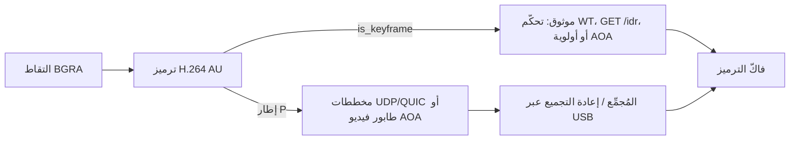

# Frame Transport - Orbiscreen

---

## اللغة

<a href="FRAME_TRANSPORT.md">English</a>

---

كيف تنتقل الصورة المرمَّزة من مُرمِّز المضيف إلى فاكّ الترميز في اللوح اللوحي. عبر Wi-Fi: UDP في أندرويد وWebTransport في الويب (تخطيطات الحزم في [UDP_TRANSPORT.md](UDP_TRANSPORT_AR.md)). عبر USB/AOA: وحدات الوصول Annex-B نفسها في إطارات الإكسسوار على القنوات الجماعية إلى MediaCodec. ويبقى MPEG-TS عبر `GET /stream`Reserve كبديل USB فقط إذا فشلت المصافحة الأصلية.

---

## 1. المصطلحات

| المصطلح | المعنى هنا |
| --- | --- |
| **وحدة الوصول (AU)** | صورة واحدة مرمَّزة بصيغة Annex-B: رموز بداية وحدات NAL. يُصدر المُرمِّز وحدات وصول، ويفكّها العميل. |
| **NAL** | وحدة طبقة تجريد الشبكة. المفيد هنا: SPS (7) وPPS (8) وشريحة غير IDR (1) وشريحة IDR (5). |
| **إطار I** | صورة مرمَّزة من نفسها وحدها (تداخلية). يمكنك فك ترميز *هذه* الصورة دون غيرها. وقد تشير إطارات P اللاحقة إلى صور *قبل* إطار I هذا. |
| **IDR** | تحديث فوري لفاكّ الترميز. إطار I خاص يفرغ قائمة مراجع فاكّ الترميز أيضاً. لا يجوز لأي ما يليه استخدام أي إطار سابق له. وهو نقطة التعافي بعد الفقد أو بعد انضمام جديد. |
| **إطار P** | صورة متوقَّعة. تحتاج صوراً سابقة ما زالت في فاكّ الترميز. أصغر من IDR. يمكن إسقاط إطار P متأخر؛ لكن ثقباً في سلسلة إطارات P يُفسد كل شيء حتى IDR التالي. |
| **الإطار المفتاحي** | في هذه الشيفرة، علم `!DELTA_UNIT` في GStreamer. طلب فرض وحدة مفتاحية يهدف إلى إنتاج IDR. تحمل المسار الموثوق وحدات الوصول تلك. |
| **SPS** | مجموعة معاملات التسلسل. المستوى والملف الشخصي والحجم المرمَّز ونص الترميز `avc1.…`. ليست بيانات صورة. |
| **PPS** | مجموعة معاملات الصورة. نمط الأنتروبيا والقيم الافتراضية المرتبطة. تشير إلى SPS بالمعرّف. |
| **GOP** | مجموعة صور: إطار IDR مع إطارات P التي تعتمد عليه. تستخدم Orbiscreen **GOP لا نهائياً**: لا يوجد IDR دوري. التحديث هو تجديد داخلي إضافة إلى IDR عند الطلب. |
| **التجديد الداخلي** | كل إطار P يتضمن شريطاً متحركاً من الكتل التداخلية. خلال نحو ثانية تتجدد الصورة كاملة دون IDR ضخم. يمكن لإطار P مفقود أن يُشفي مع مرور الموجة. |
| **VBV / CPB** | مخزن الفيديو / الصورة المرمَّزة. يحدّ الحجم الأقصى لوحدة وصول واحدة. تضبط Orbiscreen هذا على **إطار واحد** من هدف CBR حتى لا يشغل IDR مئات الأجزاء من الثانية من الشبكة. |
| **مخطط البيانات** | حزمة غير موثوقة: UDP أو مخطط بيانات QUIC في WebTransport. يمكن إسقاط إطار متأخر. الفقد محو. |
| **المسار الموثوق** | بايتات مرتَّبة مُعاد إرسالها: تدفّق تحكّم WebTransport، أو `GET /idr` عبر TCP. يُستخدم للإطار IDR مع SPS/PPS حتى تصل إطار التعافي كاملة. |
| **`seq` / `frag` / `frags`** | تسلسل وحدات الوصول في مخطط البيانات (يلتف عند 65536)، فهرس الجزء، عدد الأجزاء. إطارات IDR الموثوقة **لا** تحمل `seq` ولا تُقدّمه. |
| **الانتظار حتى IDR** | بعد ثقب، لا يمرّر العميل إطارات P إضافية إلى فاكّ الترميز حتى يصل IDR. تبقى آخر صورة سليمة على الشاشة. |

---

## 2. التدفق الطبيعي

1. **الجلسة.** ينفّذ العميل `POST /api/session` (الاسم ومفتاح الجهاز والمقاس). هذا يفتح مخرجاً افتراضياً لكل عميل ومُرمِّزاً خاصاً به. تبقى قناة الإشارة HTTP على `signaling_port` (8788). منفذان للفيديو: UDP على `8789` وWebTransport على `8790`. فيديو USB لا يستخدم هذين المنفذين.
2. **المصافحة.**
   - أندرويد على Wi-Fi: Hello عبر UDP (توكن + معرّف جلسة) ← Hello-Ack ← DPLPMTUD حتى تأكيد حجم مخطط بيانات (حتى نحو ‎1472 بايت). ثم `GET /idr` عبر TCP لمفاتيح الإطار.
   - أندرويد على USB: إكسسوار AOA فقط (بدون `adb reverse`). الـHTTP الخاص بالجلسة والإدخال يمر عبر بروكسي TCP الخاص بـAOA. الفيديو تدفّق AOA أصلي: `OPEN|VIDEO` مع معرّف الجلسة، ويرد المضيف بإثارة مؤقّت من 8 بايتات، ثم وحدات وصول `encode_video` بطول مُسبق. إذا فشلت مصافحة الفيديو الأصلية، فإن `GET /au` على البروكسي نفسه يغذّي MediaCodec. ولا يُستخدم MPEG-TS مع ExoPlayer على USB.
   - الويب: صفحة HTTPS، ثم WebTransport مع `serverCertificateHashes`، ثم Hello على التدفّق ثنائي الاتجاه ← Hello-Ack. وتستخدم إطارات P مخططات بيانات QUIC (بسقف نحو 1024 بايت).
3. **الترميز.** H.264 العتادي مُفضَّل (VA-API / NVENC) بمعدل 8 ميغابت/ث CBR، بلا إطارات B، وGOP لا نهائي، وتجديد داخلي، وVBV بحجم إطار واحد. `h264parse config-interval=1` (و`repeat-sequence-header` عند توفره) حتى يحمل IDR على SPS/PPS. و`is_keyframe` هو `!DELTA_UNIT`.
4. **التقسيم حسب `video_carrier` (Wi-Fi) أو حسب مسار USB.**
   - **الإطار المفتاحي** ← موثوق: `encode_video` (إطار WT بطول مُسبق). إن كانت SPS/PPS مفقودة، تُضاف آخر زوج مخزَّن في المقدمة (`with_parameter_sets`). ولا يزداد `seq` للمخططات. وعلى USB تُحزَّم نفس الكتلة في إطارات AOA (حمولة قصوى 16‏379 بايت، إFRA واحد لكل URB) وتُكتب على طابور **الأولوية**.
   - **إطار P** ← مخططات بيانات على Wi-Fi: يُقسَّم إلى `frag` / `frags` عند MTU المسار. يزداد `seq` بمقدار واحد لكل وحدة وصول P. وعلى USB تُرسَل الوحدة المحزَّمة بـ`try_send` على طابور فيديو بسعة 2؛ فإن امتلأ يُسقط إطار P ويُطلب IDR (القناة الجماعية عبر USB لا تفقد حزماً، وامتلاء الطابور يعني أن اللوح متأخر).
5. **العميل.**
   - أول IDR على المسار الموثوق يهيّئ فاكّ الترميز (أندرويد: MediaCodec من SPS/PPS عبر `csd-0`/`csd-1`؛ الويب: WebCodecs `avc1.…` من SPS) ويستدعي `onReliableKeyframe()` ليتعامل المُجمِّع مع P التالي كبداية GOP. ويتخطّى USB المُجمِّع: تُدمج حِمل AOA في `IdrFrames.Reader` وتذهب مباشرةً إلى MediaCodec.
   - تُعاد مخططات بيانات P إلى ترتيبها (`DatagramAssembler` / `AuReorder`). ويُمرَّر `seq` المرتَّب إلى فاكّ الترميز. ويُحفظ ثقب `seq` واحد قصير الأمد (نحو 48 مللي ثانية) تحسّباً لإعادة الترتيب.
6. **الخمول.** ping من العميل كل نحو 500 مللي ثانية. ينتهي صلاحية UDP في أندرويد بعد نحو 4–5 ثوانٍ من الصمت. وآخر مشاهد لأي جلسة يفكّ ذلك المخرج الافتراضي.

على شبكة محلية نظيفة تكون الصورة بعد إطار الانضمام الأولي كلُّه مخططات بيانات P تقريباً. والتجديد الداخلي يبقي الجودة عالية دون إطارات مفتاحية دورية.

---

## 3. الحزم المفقودة

الفقد هو **محو لمخططات بيانات كاملة** (A-MPDU على Wi-Fi، أو فشل `send_to`، أو `ORBISCREEN_UDP_LOSS_PCT`). والمضيف لا يعيد إرسال إطارات P.

### الإرسال من المضيف

- مخطط البيانات **الفاشل** (خطاف الفقد أو خطأ عابر) **لا** يوقف بقية وحدة الوصول. فقط حالة **TooBig** توقف الأجزاء اللاحقة (وهي لن تتّسع أصلاً). والإرسال الناقص يطلب IDR.
- الإطارات المفتاحية لا تُوضع على مخططات البيانات، فلم يعدConcept لzyك نسبة الإهدار القليلة مطلوبة anymore لتسليم إطار IDR من 20–40 جزءاً سليماً.

### ثقب عند العميل

1. جزء ناقص `frag` ← لا يكتمل ذلك `seq` أبداً. و`seq` كامل ناقص ← يرى المُجمِّع `delta != 1`.
2. يُحجز إطار P التالي مؤقتاً. وبعد `HOLE_WAIT_MS` (48 مللي ثانية) يُصدر المُجمِّع **gap**، ويضبط انتظار المفتاح، ويرسل العميل **IDR** (نوع UDP 6، أو `TYPE_IDR` في WT). والكبح نحو 250 مللي ثانية عند المُرمِّز.
3. تُمحى إطارات P المحجوزة من GOP القديم. ولا يُمرَّر المزيد من إطارات P إلى فاكّ الترميز (`waitingForKeyframe` / `waitKey`). وتبقى آخر صورة معروضة (الانتظار حتى IDR).
4. يفرض المضيف force-key-unit فيُنتج IDR (مع SPS/PPS) ويكتبه على المسار **الموثوق**.
5. يفكّ العميل ذلك IDR، ويستدعي `onReliableKeyframe()` (`lastSeq = -1`، مع محو المحجوز)، ثم يقبل مخطط بيانات P التالي كبداية GOP الجديد.

لولا هذا التصفير لَبَقي `lastSeq` على GOP القديم، ولبدا كل إطار P تالٍ ثقباً آخر، وانغلقت الجلسة عند نحو 2–5 إطار/ثانية (أي معدّل طلبات IDR).

### ما لا يفعله الحزم المفقودة

- لا يُغلق الجلسة. فـPing/PMTU/Hello تبقى على حِزمها الخاصة.
- لا ينتظر إطار P المفقود. ذلك الإطار راح، والتجديد الداخلي وIDR التالي يُصلحان الصورة.
- فيديو AOA الأصلي عبر USB تدفّق جماعي مرتَّب، لا مخططات بيانات. الصورة المتأخرة هي امتلاء طابور الكتابة لا حزمة مفقودة: أسقط ذلك الإطار، واحتجز حتى IDR. ويبقى MPEG-TS عبر `GET /stream` هو البديل، ولا يزال لا يستطيع الإسقاط أثناء الدمج.

### خطّافات الاختبار

| المتغيّر | الدور |
| --- | --- |
| `ORBISCREEN_UDP_LOSS_PCT` | إسقاط نسبة مئوية من مخططات UDP الصادرة (0–90) |
| `ORBISCREEN_UDP_DROP_ABOVE` | افتراض أن المخططات الأكبر فُقدت (محاكاة PMTU) |
| `ORBISCREEN_UDP_MAX_DATAGRAM` | سقف بحث PMTU |

تستخدم مخططات بيانات إطارات P تصحيح Reed-Solomon المنهجي بنمط Cauchy على GF(256). و`frags` هو عدد البيانات k. وتستخدم التكامل `frag >= frags`. والسلم: 1–3 ← بلا FEC (إطار AU صغير مفقود يُشفى بالتجديد الداخلي على x264، أو بمسار IDR-عند-الثقب على VA-API الذي لا يملك خاصية `intra-refresh`)؛ 4–16 ← ‎+2؛ 17–64 ← ‎+3؛ 65 فأكثر ← ‎+4. وتبقى إطارات IDR على المسار الموثوق ولا تُصحَّح. وعند تفعيل FEC يُسبق وحدة الوصول بطول من 4 بايتات ليُمكَّن تشذيب آخر شريحة مُعاد بناؤها.
