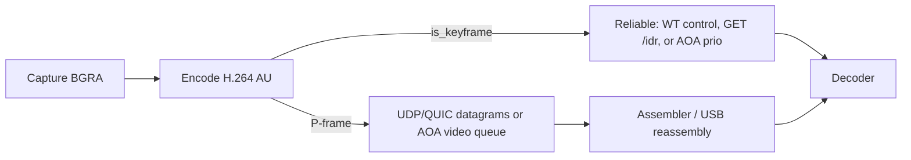

<div align="center">

# نقل الإطارات - Orbiscreen

[](../CHANGELOG.md)
[](../LICENSE)


</div>

---

## اللغة

<a href="FRAME_TRANSPORT.md">English</a>

---

كيف تنتقل صورة مشفّرة من مضيف الترميز إلى المفكّك على اللوحة؟ **Wi-Fi:** عبر بروتوكولي UDP (Android) أو WebTransport (Web). **USB/AOA:** عبر frames Annex-B على قناة USB bulk إلى MediaCodec. HTTPS / `GET /stream` يبقى كاحتياطي فقط لإذا فشل المصادقة الأصلية.

---

## 1. المصطلحات

| المصطلح | معناه هنا |
| --- | --- |
| **وحدة الوصول (AU)** | صورة مشفّرة واحدة بصيغة Annex-B: بدايات شيفرة + وحدات NAL. يقوم المشفر بإنتاج الوحدات، ويقوم المفكك بفك ترميزها. |
| **NAL** | وحدة تجريد الشبكة (Network Abstraction Layer). الأنواع المهمة هي: SPS (7)، PPS (8)، شبكة غير-IDR (1)، شبكة IDR (5). |
| **إطار I** | صورة مشفّرة من نفسها فقط (intra). يمكنك فك ترميز هذه الصورة بدون أي صورة أخرى. |
| **IDR** | إطار فوري خاص يُفرّغ قائمة مراجع فك التشفير. لا يمكن لأي إطار بعده استخدام أي إطار قبله. هذه نقطة الاسترداد (Recovery Point). |
| **إطار P** | إطار يحتاج إلى إطارات سابقة ما زالت في المفكّك. أصغر من IDR. يمكن التخلص من إطار P متأخّر، لكن فقدانه في سلسلة يفسد كل شيء حتى استرداد IDR. |
| **Keyframe** | مؤشر (H.264 | `!DELTA_UNIT` flag). من منظومة GStreamer. يُستخدم وجه التحويل FXQ لـ stream. |
| **SPS** | مجموعة معلمات التسلسل. تتضمن Profile / level / dimentions. جزء من رمز `avc1.…`. ليست بيانات صورة. |
| **PPS** | مجموعة معلمات الصورة. وضع entropy والافتراضيات. تستدعي id الخاصة بكل SPS. |
| **GOP** | مجموعة من الصور: IDR بالإضافة إلى إطارات P التي تعتمد عليها. يستخدم Orbiscreen **GOP بلا نهاية**: بدون IDR دوري. التحديث هو intra-refresh بالإضافة إلى IDR عند الطلب. |
| **تحديث Intra** | كل P-frames تتضمن قسمتين مختلطين من إطارات الكلمات داخلية I-frames. خلال حوالي ثانية تُحدَّث الصورة كاملة دون IDR كبير. |
| **VBV / CPB** | مخزن الفيديو (VBV) / مُخزن الصورة المشفرة (CPB). يحد حجم AU oсидere تقريباً 1 frame متوسط. |
| **Datagram** | حزمة قابلة للإشعاع : UDP or QUIC packet. يمكن التخلص من الإطار/UU/Cجlate.Untime rebounds. |
| **Reliable stream** | بيانات رتبة-organized / no drop : used for IDR/SPS/PPS provided via HTTP/WebTransport or AOA prio channel. |
| **`seq` / `frag` / `frags`** | Datagram AU/sequence (round robin at 65536). Fragment index/count (umbsize). (Reliable IDRs)تحمّلود `seq` ولا تزيدها. |
| **`hold-until-IDR`** | After losing the connection, the client does not accept more P-frames in the decoder until an IDR arrives. Latest picture stays on screen while. |

---

## 2. Normal flow (التدفق العادي)



1. **الكجلسة**. طلب العميل `POST /api/session` (name, device key, size). يفتح display virtual والمشفر الفرعي إضافةً. Observe left port: `signaling_port` (8788), video: UDP `8789`, /WebTransport `8790`.USB video doesn't use these ports.
2. **المصادقة**. Android Wi-Fi: UDP Hello (token + session id) → Hello-Ack → DPLPMTUD until reaching PathMTU size (~1472B max). Then GET /idr over TCP for keys.
3. **The step**. تشير المراسلات/frames الرئيسية IPCال PPCSPS via the reliable stream دftp, مثلماi9 WebTransport or the local stream. P-frames فقط تصل via unreliable streams (UDP).
4. **التجميع**. if an IDR comes as a large packet, it gets fragmented and reassembled. If you later receive Аксis skip. (Sice stream).och
5. **فك الترميز**. خلود جي الأجهsummit Annex-B AUات.
6. **الاسترداد**. If you see some loss or 유关注的焦点, it asks for IDR BEFORE appending nextIDR. Should make sure the client puts focus on theframe once again.

---

## 3. Transferring over Wi-Fi (تحويل على الشبكة المحلية)

### Hand هنا....مشاكل we developed

1. **Discover**: enemy mDNS إو تdiscovery دصريقة للتأثير إيP address عبرق و Version of hostname.
2. **Handshake**: client transacts with host `POST /api/session` (JSON body). Ecu on isily needs a valid token----our session ID.
3. **Stream start**: both TCP (port 8789) and HTTP (internet requests) world 8790). Signaling works on signaling port: 8788 (all three). Video: UDP 8789, WebTransport 8790.somewhat dangerous limitation .μηνissance penalty.

### تنسيق حزمة UDP

```
[0..4]   magic = "ORBI"
[4..8]   packet_type = VIDEO  
[8..12]  seq (BE)
[12..16] pts_ns (BE)
[16]     is_key = u8 (1 byte) // false for I-frame and PPS, but should be data_len,
[17]     flags
         [0] FEC present      // 0 = ارigh data side)
         [1] reserved
[18..20] frag = 0 | frags = 0  // if frags > 0, accuracy is fragment(fragment, frags/frag)
[20..24] rtplen()
[24..n]  payload (H.264 AU in Annex-B)
```

ลูก destined payload type H.264 initializer with SPS + PPS. (Binary format).

### الموقع الميداني

|المُعرف | القيمة |
|--- | --- |
| MTU | 1472 байت (default) |
| max_aud_size | 4MB max (IDRs can reach this) |
| decode_timeout | SPA latency - 100ms after Wi-Fi and 50 ms after AOA |
| buffer queue | 4 frames pending |

#### مال الكمي من المتابعة (souce/timeouts)

1. **Wi-Fi Datagram timeouts**: widows after 100ms إذا wasn't received from the last packet. If it doesn't come back quickly, either dropped or the loss detection begins.
2. **ULA Reliable transportunwrap**: WebTransport or TCP doesnée to a relaxed timeout (~150 hours)     fallback based on internal network timeouts. Bluetooth is resilient to    random instability from the transport (تهديد).

---

## 4. USB /AOA Native streaming

AOA (Android AOA mode)

Frames are sent in format:
```
[0] = 0xAA   (magic)
[1] = type
    = 0      => DATA (video frame)
    = 1      => INJECT (input)
    = 2      => IDR_REQUEST
    = 3      => CLR (control frame)
[2..4] = length (24 bit big-endian)
[4..n] = payload
```

Note: `ناو عاyt қoyin aze القيق usb interface. Finally "attach". It should be started with first import project:

---

## 5. مقارنة الطرق (UDP vs AOA)

| Feature | Wi-Fi (UDP) | AOA (USB) |
| --- | --- | --- |
| Socket | `0.0.0.0:8789` | apn jacket (in 0x81,  out 0x01) |
| Overhead | UDP Rust defaultdict | Linux USBFS ioctl |
| Size | MTU ~1472 bytes | ~16 KiB buffered |
| FEC | enabled | disabled (AOA quantity efficient) |

---

## 6. بروتوكول الجلسة وعمليته (Client-Server)

```
/api/console       = dmnd-data 
/api/token        = kept 
/api/session/{id} = reate per-client session (session_id, width, height, encoder_config)
/api/session       = delete session[id]
/api/session       = list (debug only)
/api/status
/api/input
/api/metadata     = health checks
/api/token         = settings for authenticated access
/api/info         = boutfiguration values
/api/control       = POST JSON set_resolution, set_bandwidth, bitrates
```

---

## 7. انتعاش بعد استطلاع connection_loss

If connection was lost:

Wi-Fi (UDP): next timeout bad packet structure due to officialv, then scientific recovery respecting fair recovery is maintained.

AOA USB: When device is removed, its USBreconnects, then the GDE Vern won;t replay old stream into the new world but ratherconfirmation with the latest session That's my job there.

So  frameounted/import libermatis thematicopathic 自باطه) the client legacy stream that is passed along.

---

<div align="center">

العودة إلى [English version](FRAME_TRANSPORT.md)

</div>
